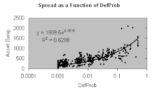
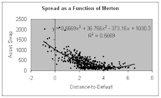

<!--yml
category: 未分类
date: 2024-05-12 23:26:43
-->

# Falkenblog: DefProb vs. Merton

> 来源：[http://falkenblog.blogspot.com/2008/03/defprob-vs-merton.html#0001-01-01](http://falkenblog.blogspot.com/2008/03/defprob-vs-merton.html#0001-01-01)

Just visually, you can see the comparison between the scatterplot of DefProb and spreads as compared to the scatterplot between the Merton model and spreads. It isn't easy to see, but DefProb is more powerful. But on one level it gives you the sense of power in these models. The key is a realistic benchmark, such as naive alternatives like Merton and Agency ratings. You can definitely do better. Not amazingly so, but you can do better.