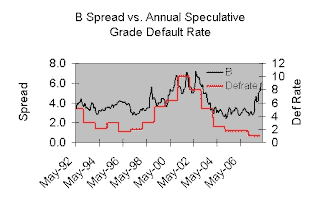

<!--yml
category: 未分类
date: 2024-05-12 23:25:36
-->

# Falkenblog: Depression? What about defaults?

> 来源：[http://falkenblog.blogspot.com/2008/03/depression-what-about-defaults.html#0001-01-01](http://falkenblog.blogspot.com/2008/03/depression-what-about-defaults.html#0001-01-01)

Check out the graph. As spreads have widened to historical highs, the default rate for speculative grade securities in the US has not been lower since 1981! Who'd a thunk it? [default data from Moody's] I don't things are nearly as bad as people think.

Paul Krugman

[writes](http://www.nytimes.com/2008/03/21/opinion/21krugman.html?ex=1363752000&en=d4be1d2ea1520dfe&ei=5124&partner=permalink&exprod=permalink)

that we are potentially at the beginning of another Great Depression, and therefore, we need to regulate more. I'm not clear what particular regulation he considers so useful. The main effects of the 30's regulation on securities markets is basically generating greater costs of entry, by mandating lots of silly bureaucratic formalism to the extent you promise not to lie, cheat and steal. All the indigent and illiterate criminals were now excluded, but that's not much. And separating investment banking from commercial banking, did nothing (never adhered to in Europe).

I think people need some context. Unemployment is only 4.8%, below the average during the Clinton years. There have been no bank runs, just the failure of a few hedge funds and their ilk. This is the wonderful thing about deregulation, in that financial excess, and it opposite, have smaller real effects.