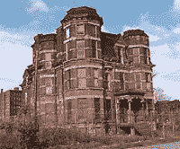

<!--yml
category: 未分类
date: 2024-05-12 21:04:16
-->

# Falkenblog: Detroit Implodes

> 来源：[http://falkenblog.blogspot.com/2011/03/detroit-imploads.html#0001-01-01](http://falkenblog.blogspot.com/2011/03/detroit-imploads.html#0001-01-01)

One of the more striking findings in William Easterly's writings about Third World Aid is how little is learned, just the continual call to double down: it was just not enough or to the wrong people. Similarly, when Detroit

[recently announced](http://www.nytimes.com/2011/03/23/us/23detroit.html?scp=5&sq=Detroit&st=cse)

they lost 25% of their populace over the past decade, the solutions sounded the same: double down. A friend of mine drove me by his childhood home in Flint Michigan and every corner strip mall highlighted two products: lottery tickets and alcohol. His old home now had security bars around its first floor windows.

There are two obvious features about American inner cities and neither are talked about very much (see the

[NYT discussion](http://www.nytimes.com/roomfordebate/2011/03/28/the-incredible-shrinking-city?ref=us)

, no mention). First, most have long and deep Democratic political rule. That is, not only the mayor, but the police chief, school superindendent, and every other head bureaucrat is a Democrat. Five of the 10 cities with the highest poverty rates (Detroit, Buffalo, St. Louis, Milwaukee, Philadelphia and Newark) have had a Democratic stranglehold since at least 1961, and most dangerous big US cities are strongly Democratic. Why isn't this relevant?

The other feature is these cities are predominantly black or Hispanic. Few can even mention this without being called a racist, and most important writers have legitimate reason to avoid even being accused of racism, which can cost you your career (meanwhile, Spencer Ackerman, who was

[caught red handed](http://www.csmonitor.com/USA/Politics/2010/0720/JournoList-Is-call-them-racists-a-liberal-media-tactic)

advocating the racist libel as a progressive strategy, has been unaffected, highlighting its potency). So, as a non-professional, I'll ask: Why are these minorities performing so poorly when concentrated?

Honest Italian-Americans ended up greatly benefiting from the collapse of the briefly-lived

[Italian American Civil Rights League](http://en.wikipedia.org/wiki/Italian-American_Civil_Rights_League)

in 1971\. These were the people who would say with a straight face they didn't know what the word 'mafia' meant. With the danger of being accused of racism removed, the federal government during the Reagan Administration hammered the Mafia and left it a shell of what it once was. Since the Mafia preyed most of all on their co-ethnics, that was a huge win for Italian-Americans. This issue is not whether or not one group is more prone to nefariousness than any other. The issue is that if any group is exempted from criticism, the temptation for members of the group to do bad things increases. We all have urges that are worthy of criticism, but if we can arrange matters so nobody is allowed to criticize us, then the temptation to give in to those urges can be overpowering.

American minorities don't need money, pity, or special rights, they need temperance, diligence, thrift and other bourgeois virtues, exactly what their community leaders are telling them are orthogonal to their position. The last thing you should tell someone in really bad straights is that his problem is the indifference, if not cruelty, of others, because it doesn't help him.

Democrats and black leaders bear most of the blame for the Detroit, and this should be a teaching moment. Yet, I see no such re-evaluation, and so I have little hope for American Cities, which I assume in a generation will be like the favelas of Brazil, places the police won't even go.