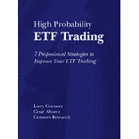

<!--yml
category: 未分类
date: 2024-05-12 21:43:51
-->

# Falkenblog: Developing an Investment Strategy

> 来源：[http://falkenblog.blogspot.com/2009/11/developing-investment-strategy.html#0001-01-01](http://falkenblog.blogspot.com/2009/11/developing-investment-strategy.html#0001-01-01)

I know many people who trade stocks frequently but shouldn't. If you look at the most active stocks, they include many

[ProShares](http://www.proshares.com/)

stocks that give you two, even three times the leverage of the regular stock market. Thus, the risk minimization from diversification implicit in indices is removed via leverage. Unfortunately, this does not amplify the 'equity risk premium' because the high amount of trading in these vehicles generates significantly drag longer term: being long the UltraPro S&P500 (UPRO) gives you three times the leverage against the S&P500 daily, but over the long run, a worse performance!

If you are going to invest this way, the best thing you can do is work out a system. Develop rules, test them, write them down, and at the end of the year, evaluate your results. If you fail, perhaps give it another year. But after a few years, if you underperform standard benchmarks (eg, the SPY ETF), then either get out of the market, or stop trading, an simply invest in the SPY.

A book like Larry Connor's

[High Probability ETF Trading](http://www.amazon.com/High-Probability-ETF-Trading-Professional/dp/0615297412/ref=sr_1_2?ie=UTF8&s=books&qid=1257950548&sr=1-2)

is a good place to start. The author presents a straightforward technical trading strategies, mainly based on momentum over longer periods (eg, 200 days), and mean reversion over shorter horizons (eg, 3 days). There's a lot of empirical research that suggests these trends generally exist, in that momentum is one of the famous equity risk factors (from Jegadeesh and Titman), while mean reversion underlies a lot of 'stat arb' strategies. The issue is, can you use these facts to add alpha to a naive strategy of going long and forgetting about it.

In trying to be clever, there are two things going against you at all times. First, there are many nuances to any actual implementation, and if you play around enough something will work if only by chance. Thus, you have to be disciplined when testing these strategies because it is easy to find something if you try hard enough--torture the data enough and it will confess. Second, there are transaction costs. For a retail investor, I would assume a one-way cost of 2 cents a share. Make sure this cost is included in your performance results.

So, Connors' book walks through several such rules (buy if these 5 conditions are true, exit if this one condition holds). You can learn how to test strategies downloading daily Open-High-Low-Close from Yahoo!, and set up a spreadsheet to apply it to the past 5 or even 50 years of daily data. You may not like his specific rules, but it clues one in on what kinds of things people find useful, and if you can test his strategies, you are then in position to create your own, similar strategies.

Most importantly, if you plan on trading more than once a year, you should have a testable system. Maybe it's based on fundamentals, but at least you should have a written record of what you were thinking, and when. The main thing to avoid is investing ad hoc every year,and not learning that you are wasting money and time. Most people are wasting their time at anything innovative: your average poet, screenwriter, trader. The key is to discover if you are in the 'talented tenth' ASAP, because sampling alpha is costly.

So, if you must actively invest, evaluate not just a particular tactic (buy after 2 up days when price is above the 200 day moving average), but the strategy: should you even be actively trading at all? Remember, odds are you will fail as demonstrated by the fact that most retail investors do not outperform the market, and neither do professional money managers. Do not assume that simply trying hard, or wanting it, are sufficient, because every money manager really wants to outperform, and most work quite hard. Don't take it poorly, no one is good at everything, and very few are very good at more than a few things. The key is to find what you are good at so you can do it again and again, and this takes some courageous sampling, a good effort, and then a Hardheaded evaluation.