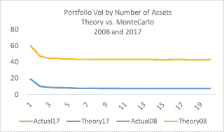

<!--yml
category: 未分类
date: 2024-05-12 19:59:07
-->

# Falkenblog: Diversification

> 来源：[http://falkenblog.blogspot.com/2020/01/diversification.html#0001-01-01](http://falkenblog.blogspot.com/2020/01/diversification.html#0001-01-01)

I was interested in calculating what the portfolio volatility would be for a portfolio given various correlation assumptions, and also the number of assets. So I took two portfolio of the S&P500 in two very different years: 2008 and 2017\. The VIX had one of its highest average levels in 2008, at 31.5, while its lowest in 2017, at 11.0.  Because I'm interested in low vol portfolios, I took the stocks with below-average volatility from the prior year.  The statistics on these 250 stocks were as follows:

Lowest 250 vol stocks in S&P500

|  | 2008 | 2017 |
| AvgVol | 60% | 19% |
| AvgCorr | 0.48 | 0.14 |

Both total volatility and correlation were about 3 times higher in the crisis year of 2008\. This is because the total market volatility was so much higher. One could say correlations rise in bad times, but one could also say that mathematically, given a 'one-factor' model (the market), if the market has higher volatility its assets will have a higher correlation.

The equation I presented last week calculates portfolio volatility as follows:

*   Volatility (n assets, correlation c)=sqrt(avgVol^2/n + (n-1)/n*c*avgVol^2)

Here c is the average correlation, so the average of the correlation matrix off the diagonal. Volatility and correlation are taken from the same period here, that in the years 2008 and 2017.

In the equation, most of this diversification benefit happens rather quickly, with 90% of it coming after n=15\. Given many people look at multiple factors, not just the market factor, this could make this formula less relevant. So I took all those 250 stocks and created thousands random of sub-portfolios to get an estimate of the actual, or empirical, volatility. 

Comparing this to the formula generated the data in the above chart: they are basically identical. You only see two lines because there are two sets of lines that overlap. In both scenarios, the 10 asset portfolio had insignificantly higher volatility than the 250 asset portfolio. While the correlations are quite different, generating different levels of diversification as a function of the number of assets, they both almost perfectly matched the simple formula.  

Bottom line: 10 assets really is enough.