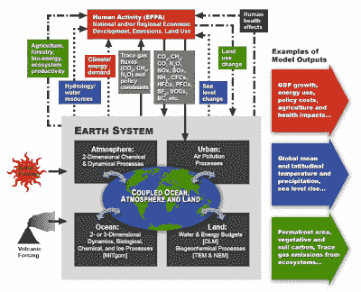

<!--yml
category: 未分类
date: 2024-05-12 22:07:34
-->

# Falkenblog: Do Global Climate Models Contain Keynesian Macro Models?

> 来源：[http://falkenblog.blogspot.com/2009/04/do-global-climate-models-contain.html#0001-01-01](http://falkenblog.blogspot.com/2009/04/do-global-climate-models-contain.html#0001-01-01)

In the 1970s there was a period when large scale, multi-equation macro models with hundreds of equations were used to forecast the economy. Those efforts were a dead end. Of course, the modelers themselves never admitted that, and those making macro models in the 1970s still make macro models today (see Macroeconomic Advisers LLC). Economics does not note approaches are failures, rather, it just stops doing them as the professors grow old and graduate students do not replace them.

Their demise was twofold.

[Chris Sims](http://journals.cambridge.org/action/displayAbstract?fromPage=online&aid=213904)

showed that a three instrument Vector Auto Regression (insanely simpler reduced form model) did just as well. His argument is applicable to any complicated model: when you have lots of interactions, every variable should be included in every equation, and so the model is

underidentified

because then there are more parameters than datapoints. Structural parameters with very different forecast implications are consistent with the same data, so you cannot forecast because you cannot

identify

the correct model. Secondly, no economic model, especially a large scale macro model, predicted that the socialist countries would severely underperform the capitalist countries, or that Africa would stagnate, or that the Asian tigers would flourish. Just about every major economic trend--computers, energy shortages, internet bubble, mortgage crisis--was seen only after they happened. Of course, they missed business cycles, and the secular decrease in inflation from 1980\. If an economist were to tell me the average GDP for Paraguay in 2050, I imagine the more complex the model, the worse their forecast.

It is very easy to convince yourself that a complex model is correct, because you can always fine tune it to the data, and the pieces are never fully specified so outsiders can't judge how much it was fit to explain the data it is testing. For climate models it appears obvious there are more degrees of freedom in such a model than the two main datapoints driving them: the 0.75 degree Celsius increase in temperature and the 35% increase in atmospheric CO2 from 1900-2000\. It is very suspicious that the models disagree a lot on specifics, like how much water vapor is expected over Antarctica, but generally agree on the temperature and CO2 implications. For a model with lots of interactions, one should see greater variability than what I have seen. I get the sense that to get funding one's work on a model has to be plausible, where 'plausibility' has already been decided.

Ronald Prin has a

[video](http://mitworld.mit.edu/video/509)

on MIT's latest climate models, and he highlighted the

economic

aspects of the global climate model. Uh oh. He stated the climate models were

as uncertain as the economic models

. That's a high standard. Prinn admits to big uncertainties in climate models: clouds, which play a large role, are difficult to model. There are also uncertainties about emissions, and ocean-mixing, the churning of cooler and warmer waters, which can bring carbon buried on the ocean floor to the surface. He says there are 'hundreds' of these uncertainties. His solution is to look at the model under various changes in assumptions, generating hundreds of thousands of forecasts to estimate the probability of various amounts of climate change. As he states, “in the Monte Carlo sense, building up a set of forecasts on which we can put a measure of the odds of being correct or incorrect.”

But enumerating changes in assumptions and then looking at the effects is not an unbiased nor asymptotically consistent estimation process. Why should we believe the model is correct even if we knew the assumptions? You have, by Prin's estimate, 'hundreds' of uncertain parameters and processes, and forecasting over 100 years. Read

[Sokolove's outline](http://globalchange.mit.edu/igsm/)

, and you merely get graphics of 20 to 30 categories interacting in some massive feedback loop, and you have these for Land, Ocean, Urban area, and the Atmosphere, broken down by 20 regions, and then assumptions on technological changes (nuclear vs biofuel growth) as well as economic growth. Looking at Sokolov's description, it appears to be using a macro model within the super global climate model:

> The current EPPA version specifically projects economic variables (GDP, energy use, sectoral output, consumption, etc.) ... Special provision is made for analysis of uncertainty in key human influences, such as the growth of population and economic activity, and the pace and direction of technical change.

Add to that the sociology-like graphs with big arrows pointing to A --> B --> A, enumerating sectoral employment growth in Modesto, and it looks a lot like those old, discredited large-scale macro models! Using a multi equation macro model in the Global Climate Model is like using a CDO squared formula to manage your portfolio.

I'm not saying there are much better models out there, just that these models are known to be useless for long term forecasting, and specifying every sector of the economy in such a manner seems like deliberate spurious precision given the known way such precision is treated by outsiders (eg, journalists) and the wealth of experience by insiders on how fruitless this approach is. These complex 'structural models' are like the early days of flight when people would strap on bird wings to fly because it emulated reality. Now we know that is a dead end, and use nothing like nature to fly. Specifying input-output relations by sector is a reasonable approach if it was not so thoroughly tried, tested, and found lousy.

Econometrician Arnold Zellner noted, after a lifetime of forecasting:

> I do not know of a complicated model in any area of science that performs well in explanation and prediction and have challenged many audiences to give me examples. So far, I have not heard about a single one. ..it appears useful to start with a well understood, sophisticatedly simple model and check its performance empirically in explanation and prediction.

Instead of evaluating the models by how much they agree under various assumptions, I would want to see some step-forward, out-of-sample forecasting. That is, run the model through time T using data only from prior to T, and see how it does in period T+1\. You do this through time and get a step foreward forecast. I haven't seen this. There are data on changes in CO2 and temperature using ice cores, but there is a causation problem: say the sun (or something exogenous) causes both warmth and CO2 rise. This will not allow you to estimate the effect of an exogenous CO2 rise on temperature unless you can identify an event with clear exogenous increases in CO2, as in a volcano. For example weight is correlated with height in humans: taller people tend to be heavier. But if you gain weight, that won't make you taller. The correlation we see over time in individuals, or cross sectionally, does not imply height is caused by changes in weight.

So many Global Warming proponents emphasize this is all about the facts and impugn the motives of global warming skeptics, yet the facts and theories underlying Global Warming scenarios are actually quite tenuous. There have been no important human-created trends or events that have been foreseen by a consensus of scientists. Adding that fact to the model implies we should ignore them.