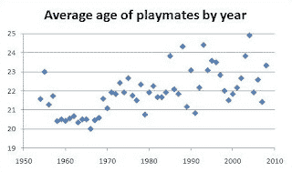

<!--yml
category: 未分类
date: 2024-05-12 23:08:38
-->

# Falkenblog: Dogged Research by Earnest Young Men

> 来源：[http://falkenblog.blogspot.com/2008/07/dogged-research-by-earnest-young-men.html#0001-01-01](http://falkenblog.blogspot.com/2008/07/dogged-research-by-earnest-young-men.html#0001-01-01)

The guys at

[GeneExpression](http://www.gnxp.com/)

love to analyze all sorts of non-PC topics related to human biodiversity, often getting into technical issues related to the

[HapMap](http://www.hapmap.org/)

project, which attempts to identify all the common Single Nucleotide Polymorphisms (SNPs). In 30 years I expect there will be lots of genetic scoring as is done for consumer loans, where one knows one's propensity towards X based on the distributional frequency of your SNPs relative people with X, where X could be a disease, a psychological trait, IQ, athletic ability, etc. As genetic sequencing becomes cheaper, I imagine this will be done, and as with consumer credit scoring, millions of datapoints make theory pretty irrelevant, people look at the patterns. It should be very interesting.

But they are still primarily young men, and so it is refreshing to see they

[turned their analytical gaze](http://www.gnxp.com/blog/2008/06/your-generation-was-more-into.php)

towards the highly controversial and important question of whether the average age of Playboy centerfolds has risen, fallen, or stayed constant. As you can see from the graph below, the average age has, indeed risen from about 21 to about 23 over the past 50 years, about the same change in age of Hugh Hefner's girlfriends over that same period.

But what about robustness? Fear not, dear reader, as the intrepid blogger 'Agnostic' also dug up data on the average age of pornstars since 1968 (no trend), while Miss America has trended up from about 16 to 22 over the past 90 years. A later post looked at the relative preferences for blondes vs. brunettes by looking at Maxim, and found

There was no significant trend in blondness over the past 11 years

(bold in original).

This kind of research needs more NSF funding.