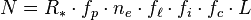
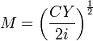

<!--yml
category: 未分类
date: 2024-05-12 20:03:24
-->

# Falkenblog: Economath and the Drake Equation

> 来源：[http://falkenblog.blogspot.com/2013/08/economath-and-drake-equation.html#0001-01-01](http://falkenblog.blogspot.com/2013/08/economath-and-drake-equation.html#0001-01-01)

There were several posts last week on the hypothesis that there's too much emphasis on mathematical modeling in modern economics.  Most said yes (

[Dave Hendersen](http://econlog.econlib.org/archives/2013/08/the_tragedy_of.html#comments)

,

[Bryan Caplan](http://econlog.econlib.org/archives/2013/08/economath_fails.html#comments)

,

[Noahpundit](http://noahpinionblog.blogspot.com/2013/08/a-few-words-about-math.html)

,

[Robin Hanson](http://www.overcomingbias.com/2013/08/math-over-used-but-useful.html)

, The

[NewYorkTimes](http://opinionator.blogs.nytimes.com/2013/08/24/what-is-economics-good-for/)

), though Krugman said no.

Krugman's experience is very pertinent as his Nobel Prize winning model on increasing returns to scale is a good example of obtuse economodeling: its thesis was known before being the basis of the centuries-old infant industry argument, and after Krugman it was no easier to apply. Consider Detroit, a popular application for regional increasing returns when applied to autos in the early 20th century: what were the key conditions that allowed it enjoy increasing returns to scale in the early 20th century, but then decreasing returns to scale later in the century? He doesn't say.

Krugman

[responded](http://krugman.blogs.nytimes.com/2013/08/22/more-economath/?_r=0)

that his theory changed the debate, because it showed--under certain parameterizations--that increasing returns to scale

*can*

be an argument for lower trade barriers! While true, this is a possibility, not a probability, and those who believe in increasing returns to scale invariably are more inclined to believe in selective tariffs, that is, they don't use Krugman's model to support free trade but rather increased protection. So, it hasn't changed the debate and is counter to his assertion that his New Trade Theory is "probably the main story" in import-export arguments for decreasing trade restrictions; his new model has not changed the debate at all, merely added another obscure reference to the confabulators. Increasing returns to scale remains 1) a fringe argument and 2) used primarily to support trade restrictions, as it was in the 1900s before Krugman's New Trade Theory model.

Krugman is a very smart person, but the fact he can't see this highlights that the greatest lies we tell are the ones we tell ourselves, because he clearly has the capacity to see slight inconsistencies and flaws in others (he's a meticulous advocate against his opponents).

I think a lot of math in econ is like the cargo cult phenomenon, where people see correlations (planes and cargo) and suppose the essence of something is one of those correlations (eg, build models of planes, and cargo will show up). Thus, just as naive people think the essence of a good poem is rhyming, naive economists think that setting up a hypothesis as if one were deriving the Dirac equation or special relativity seems like the essence of a science. Unfortunately, economic equations rarely work out that way.

 Consider the

[Drake equation](http://www.seti.org/drakeequation)

.

Where

N = the number of civilizations in our galaxy with which communication might be possible

*R*^*

= the average number of star formation per year in our galaxy

*f*[p]

= the fraction of those stars that have planets

n

[p]

= The number of planets, per solar system, with an environment suitable for life

etc.

None of the terms can be known, and most cannot even be estimated. As a result, the Drake equation can have any value from a hundred billion to zero. An expression that can imply anything implies nothing. I mean, this formulation is worthy of writing down, but it's very different than the Dirac equation or Newton's laws, even though at some level there's a similarity.

I remember teaching a money and banking course, and a fun way to get the kids introduced to economic models is to show them the

[Baumol-Tobin money demand model](http://en.wikipedia.org/wiki/Baumol%E2%80%93Tobin_model)

.  This can be derived from some simple assumptions, and applies calculus to the maximization function individuals would apply, generating the equation:

Where

M=money demand

C=cost of withdrawing money

Y=Total income

i=interest rate

All very rigorous and tidy.  Yet, it doesn't help predict interest rates, or the size of money aggregates.  It's empirically vacuous, because it simply doesn't fit the data.

That's one of the more concrete equations.  Most equations are like this one for money demand:

 

Basically one merely argues what arguments should be in the function and then the derivatives on those arguments.  Thus, the first argument is 'permanent income' Y

[p]

, and the first derivative here is positive.  Yet, the parameters can vary wildly, and may even be endogenous themselves. At the end of the day, atheoretical vector-autoregressions do a better job predicting any of these variables.

Yet, for all the insufficiency of mathematics in creating a good science, sociologists show that an absence of rigor doesn't seem to be any better.  I think this highlights there's no delusion greater than the notion that method can make up for lack of common sense. Ultimately, there is no method but to be very intelligent.