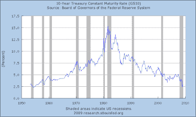

<!--yml
category: 未分类
date: 2024-05-12 22:16:11
-->

# Falkenblog: Economic Inference With Little Data

> 来源：[http://falkenblog.blogspot.com/2009/03/economic-inference-with-little-data.html#0001-01-01](http://falkenblog.blogspot.com/2009/03/economic-inference-with-little-data.html#0001-01-01)

Interest rates fell sharply last week as news came out about the Fed's new program of buying long term bonds. 10 year yields went from 3.0% to 2.5% last Wednesday.

Bonds are a funny asset. Looking at a time series of long term interest rates from 1950, we see a simple pattern: it rises to 1980, and falls to today. How the heck do you extrapolate from that?! In a sense, it looks like we have two observations, the increasing regime from 1950 to 1980, and then a decreasing regime from 1980\. Under that interpretation, you don't really have enough data to really draw any conclusions.

I've noted many bond strategies that people simulate generate nice Sharpe ratios if they are implicitly long, going back 30 years seems like a large data set. Clearly, this then begs the bigger question, about whether the secular decline in interest rates will continue. Thus, like housing derivatives, many sophisticated bond strategies can make mistaken assumptions, but even a non-quant can ask the simple question: what is the effect of the sample time trend on your trading strategy?

I would just say that given our government is bent on doing everything possible to inflate asset prices again--government borrowing and spending, monetary expansion--it seems likely that inflation, and thus interest rates, will rise. We are like people who drink hard alcohol to get drunk, where the first sensation of inebriation is well past the point of moderation. Plus, there's a lower bound on interest rates, and we are pretty close to it.