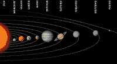

<!--yml
category: 未分类
date: 2024-05-12 22:18:22
-->

# Falkenblog: Economists Aren't More Stupid than Other Scientists

> 来源：[http://falkenblog.blogspot.com/2009/03/economists-arent-more-stupid-than-other_11.html#0001-01-01](http://falkenblog.blogspot.com/2009/03/economists-arent-more-stupid-than-other_11.html#0001-01-01)

While economists have been taking a beating for not predicting the future correctly, it is useful to remember that when you take a physicist to the real world, he too has little to say. Consider our understanding of our solar system, a seemingly straightforward issue.

Mercury

: Has an abnormally large iron core. For its size, its density seems too high. This is a puzzle. Leading theory:

[hit by asteroid](http://www.astronomy.ohio-state.edu/~pogge/Ast161/Unit6/mercury.html)

.

Venus

: Venus rotates in a clockwise fashion, in contrast to other planets. Leading theory: an

[asteroid hit it](http://www.astronomycafe.net/qadir/q50.html)

to spin the other way

Earth:

No one knows where the water came from. Leading theory:

[snow comets](http://blogs.howstuffworks.com/2007/09/28/where-did-all-earths-water-come-from/)

hit us. The moon's origin, also, is not obvious, because it doesn't have enough iron, and if it just spun out of a really fast spinning earth, the earth would still be spinning fast or the energy release needed to slow the earth down would raised the temperature to 1000 degrees Celsius. Nebula forming two planets, or planetary capture, don't work. Leading theory: an

[asteroid hit the early Earth,](http://physicsworld.com/cws/article/news/17802)

creating the moon.

Mars:

There appears to be evidence that Mars used to have water, as it seems to have lots of old lake beds and dry river beds. Why did the water leave? The atmosphere is currently about 0.3% of the earth's, so currently water goes immediately from ice to water vapor and then floats into space. So where did the atmosphere go? Solution: solar winds, or an

[asteroid hit it](http://www.usatoday.com/tech/columnist/aprilholladay/2006-03-06-mars-water_x.htm)

and pulled away the atmosphere.

Jupiter:

Jupiter is 1300 times the volume of the earth, yet spins around once every 10 hours. Puzzling.

Saturn:

Where did the rings come from? At some point in Saturn's early history, a moon about 300 km across got too close to Saturn and was torn into pieces. Or, it's also possible that two moons collided together, or a moon was struck hard enough by an

[asteroid](http://www.universetoday.com/guide-to-space/saturn/formation-of-saturns-rings/)

that it just shattered.

Uranus:

Uranus spins on its side, rolls around like a ball, unlike the other planets. This is a puzzle, because in theory, the solar system started as a spinning nebula of debris that generated a similar spin to it agglomerated parts, and also because its moons circle the planet on a different axis. Solution:

[an asteroid](http://wiki.answers.com/Q/Why_does_Uranus_spin_on_it's_side)

hit it. The moon Miranda has a very

[strange surface.](http://www.solarviews.com/eng/miranda.htm)

There are huge faults, smooth plains, and curiously shaped rifts, smooth in some areas, rocky in others, that make it seem like it has different parts. A leading explanation:

[hit by asteroids](http://www.space.com/scienceastronomy/solarsystem/miranda_creation_011016-2.html)

.

You can only use the 'hit by an asteroid' explanation so many times, before it starts sounding like a filler for 'we have no good theory'.

We have a lot of work to do figuring out lots of prosaic stuff. Nobel physicist Robert Laughlin

[points out](http://www.amazon.com/Different-Universe-Reinventing-Physics-Bottom/dp/0465038298/ref=sr_1_3?ie=UTF8&s=books&qid=1236788385&sr=1-3)

, much interesting physics are emergent phenomenon, they are not derived from basic forces. Very little, if any, collective organizational phenomenon, such as crystallization and magnetism, has ever been deduced from its lower lower-level parts.Those predicting the

[End of Physics](http://www.amazon.com/End-Physics-Myth-Unified-Theory/dp/0465019765)

are ignoring all the interesting problems that are not

potentially

generalizable to everything.

A physicist's ability to predict the terminal velocity of rocks falling from the Tower of Pisa, is like an economist predicting that when you subsidize something you get more of it. True in itself, but few are interested in such isolated phenomena.