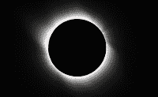

<!--yml
category: 未分类
date: 2024-05-12 21:25:53
-->

# Falkenblog: Eddington's Experiment Was Bogus

> 来源：[http://falkenblog.blogspot.com/2010/07/eddingtons-experiment-was-bogus.html#0001-01-01](http://falkenblog.blogspot.com/2010/07/eddingtons-experiment-was-bogus.html#0001-01-01)

Einstein stated that common sense was nothing but the collection of prejudices we acquire before the age 18\. I think that's pretty correct. Most people don't change their minds on big issues during their working lives, though they may acknowledge certain tactics within their grand theory are not fruitful.

The

[Skeptics' Guide to the Universe](http://www.theskepticsguide.org/)

has a

[podcast](http://cdn3.libsyn.com/sgu5x5/SGU5x52009-06-05.mp3?nvb=20100721171303&nva=20100722172303&t=097a120d76a20fc735fc9)

on the 90th anniversary of Sir Arthur Eddington's eclipse experiment that supposedly proved General Relativity was correct. While one discussant mentioned that the experiment had higher standard error than could have proved this, the next discussant said all measurement issues were addressed appropriately, and that claims Eddington engaged in fraud are pure myth. In the end, one discussant states, this is how real science is done: testing theories against reality.

I agree this is how real science is done, but contra the discussant, it was a bogus confirmation of Einstein's theory, tendentious cherry picking of what to leave in, what to leave out. The fact that the theory was correct does not change this, and it's very tempting to use hindsight to give the scientists involved the benefit of the doubt, especially when something is generally accepted. Deferral to conventional wisdom has some logic to it, but when you look at the past and note how many important beliefs were clearly untrue, there are probably many common scientific beliefs today that are untrue (unless somehow now we finally have everything right).

To recap the issue, in 1919, Einstein’s General Theory of Relativity was only a few years old, yet academics were eager to put the nightmare of World War I behind them and show the common bond of the old adversaries. Proving the German’s theory correct was greatly desired by scientists who rightly saw the conflict as simply madness. The null hypothesis, set up by standard Newtonian Physics, was that there should be a 0.85 arc-second deflection in light from stars behind the sun, while Einstein predicted a 1.7 arc-second deflection.

English physicist Arthur Eddington was a WorldWar I pacifist, and so had a predisposition to mend the rift between German and English academics. He made a trek to the island of Principe, off the coast of West Africa, one of the best locations for observing the eclipse. He used a series of complex calculations to extract the deflection estimate from the data and came up with an estimate of 1.6 arc-seconds. Data from two spots in Brazil from that same eclipse were 1.98 and 0.86, but Eddington

threw out

the 0.86 measurement.

In 10 further eclipses from 1922 to 1952 only one of these produced seemingly high-quality data, and in that case generated results much greater than Einstein predicted. In 1962, an English team tried to redo the experiment given a similar eclipse and methodology but newer equipment, and they found they could not. The tools and the event were simply too primitive to allow the kind of accuracy needed to prove general relativity via this experiment at that time. Eddington's dismissal of observations that would have lowered the key measurement's mean and increased its standard error used an objection that could just as easily been applied to the measurements he kept. In the late 1960s, using radio frequencies as opposed to pictures from an eclipse, Eddington’s results were confirmed, but that does not make that initial experiment good empirical research.

Eddington's method is held up as the epitome of science, and currently

[Wikipedia states](http://en.wikipedia.org/wiki/Arthur_Stanley_Eddington)

"The myth that Eddington's results were fraudulent is a modern invention

[citation needed]

". Indeed.

Eddington died after a life of honors, his eclipse experiment his most conspicuous achievement, yet it was tendentious empirical work. Science is filled with fraud behind correct results: Mendel fudged his numbers, Pasteur was hardly fair to his critics. A great deal of science is motivated by confabulation, generating evidence for prejudices. In that sense scientists are little different than most professions, where one has ideals vs. reality. Lawyers aren't primarily interested in justice, teachers aren't primarily interested in children, even 'the best'. After all, unlike judges, most scientists have a rooting interest for whatever theory they are proposing, they want to be the founding father of some branch of knowledge. Those of us merely judging, meanwhile, are choosing between two choices, and as we don't have any skin in the game, we want the truth because that's what's helpful.