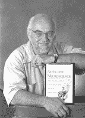

<!--yml
category: 未分类
date: 2024-05-12 20:06:22
-->

# Falkenblog: Einstein Rebuked

> 来源：[http://falkenblog.blogspot.com/2013/04/einstein-rebuked.html#0001-01-01](http://falkenblog.blogspot.com/2013/04/einstein-rebuked.html#0001-01-01)

Interesting take on a cliche:

> I once read that the definition of insanity is doing the same thing over and over and expecting different results. I fundamentally disagree with this idea. I think that doing the same thing over and over and expecting different results is the definition of hope. ~[Debbie Millman](http://www.stumbleupon.com/su/8CrYA2/literaryjukebox.brainpickings.org/post/36877015151/)

As someone who does the same thing most days, often coming up with nothing, I find this interpretation a real breakthrough.

...

I've been reading a lot of

[Jaak Panksepp](http://brainsciencepodcast.com/bsp/2010/1/13/affective-neuroscience-with-jaak-panksepp-bsp-65.html)

 who studies 'affective neuroscience', the biology of emotions like rage, fear, lust, care, panic, grief, and play.  He's famous for documenting when rats laugh via  inaudible chirps that correspond to tickling and the appropriate brain scan signatures. Lots of mammals have the same emotions humans do, which should come as no surprise to dog owners. He notes that he purpose of play is to takes us to the point of bad things happening, which explains why my kids always seem to end play with someone crying. He sees an instinct for seeking social interaction that turns on once the stronger affects (fear, lust, rage) as well as hunger are in check. It's useful to have an instinct to seek novelty and company, and it appears this is hard-wired.  If you take too much opiates, or are autistic, this instinct is stifled.

....

As for the Rienhart and Rogoff

[brouhaha](http://krugman.blogs.nytimes.com/2013/04/26/the-medium-term-is-not-the-message/?smid=tw-NytimesKrugman&seid=auto)

, I don't see the big deal given our total debt-to-GDP ratio is

[like 500%](http://www.pimco.com/EN/insights/pages/skunked.aspx)

if you include Social Security, Medicare, and Medicaid. The fact that 90% isn't a hard tipping point is irrelevant, we are way past that. Further, given we have been running a Federal deficit above 5% of GDP since 2009 every year, the idea that this R and R research has caused great austerity implies a novel definition of austerity.

 ...

I'm sympathetic to Barry Schwartz's admonition that we should satisfice more as a rule: optimizing too much leads to feeling bad about alternatives that are pretty similar. A lot in life is random, so if in picking a college or career you keep wondering 'what if?' you will be less happy and it's unhelpful because generally things you chose among were pretty similar. I think it's a very interesting question how and when to constrain choices you present others: too much choice is onerous, but more choice can better fit someone's unknown preferences. Unfortunately, those skeptical of the market seem drawn to think regulation could be of big help here; I think it's far better to leave such choices to those with skin in the game and a knowledge of the customers.  That is, bureaucrats will often think more than 3 of something they don't care about is enough, because for them it is, but that's a very silly inference. The

[Bloggingheads](http://bloggingheads.tv/videos/17481)

discussion is below:

<embed allowscriptaccess="always" flashvars="diavlogid=17481&amp;file=http://bloggingheads.tv/playlist.php/17481/00:00/64:38&amp;config=http://static.bloggingheads.tv/ramon/_live/files/2012/offsite_config.xml&amp;topics=false" id="bhtv17481" name="bhtv17481" src="http://static.bloggingheads.tv/ramon/_live/players/player_v5.2-licensed.swf" type="application/x-shockwave-flash">