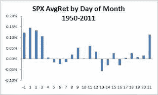
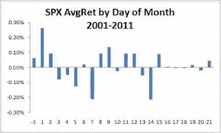

<!--yml
category: 未分类
date: 2024-05-12 21:03:31
-->

# Falkenblog: End of Month Anomaly

> 来源：[http://falkenblog.blogspot.com/2011/04/end-of-month-anomaly.html#0001-01-01](http://falkenblog.blogspot.com/2011/04/end-of-month-anomaly.html#0001-01-01)

Calendar effects in stock returns have been prominent in the finance literature since the 1970s. It's easy to pull in a time series and look at things like January, Monday, or beginning of month. Josef Lakonishok and Robert Haugen wrote a book, The Incredible January Effect, in 1988\. Alas, most of this effect was in smaller stocks that were hard to trade, and while it may have existed, it no longer does.

I used to think these calendar effects were gone, but the end-of-the-month effect seems to live on.

[Lakonishok and Smidt (1988)](http://rfs.oxfordjournals.org/content/1/4/403.abstract)

reported a turn-of-the month seasonal in equity returns wherein the turn-of-the-month is defined as beginning with the last trading day of the month and ending with the third trading day of the following month. Using the Dow Jones Industrial Average, they find that on average the four days at the turn-of-the-month account for all of the positive return to the DJIA over the period of 1897-1986\. More specifically, over this 90-year period, the average cumulative return over the four-day turn-of-the-month is 0.47% whereas the average cumulative return over the full month is 0.35%, indicating that returns were, on average, negative over the remaining days of the month.

So I downloaded the S&P data from 1950, and was surprised to see it actually works! Data are averages of log returns, and days are trading days from the beginning of the month, where -1 is the day immediately before the end of the month. See the top graph. But then I looked at the past 10 years, and the results seem not so good. Looks like another example of failed or extinct calendar effects.

