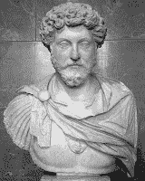

<!--yml
category: 未分类
date: 2024-05-12 21:46:28
-->

# Falkenblog: Epictetus the Life Coach

> 来源：[http://falkenblog.blogspot.com/2009/10/epictetus-life-coach.html#0001-01-01](http://falkenblog.blogspot.com/2009/10/epictetus-life-coach.html#0001-01-01)

Barbara Ehrenreich has a

[new book out](http://www.time.com/time/health/article/0,8599,1929155,00.html)

about the perils of positive thinking, and it highlights a growing counter-movement in the self-help genre. Studies suggests all those 'Think to Win!' books are actually harmful to your health. Books like

[The Little Gold Book of YES! Attitude](http://www.amazon.com/Little-Gold-Book-YES-Attitude/dp/0131986473/ref=sr_1_1?ie=UTF8&s=books&qid=1255618712&sr=1-1)

or

[The Secret](http://www.amazon.com/Secret-Rhonda-Byrne/dp/1582701709/ref=sr_1_1?ie=UTF8&s=books&qid=1255618772&sr=1-1)

are all about you getting you to be positive all the time to achieve, well, anything. Tony Robbins, Joel Osteen, Martin Seligman, Nathaniel Branden, all preach the power of positive thinking. Like methamphetamine this is invigorating at first, enervating in the end. Research has shown that depressed people are actually

[more realistic](http://www.depressionisachoice.com/essays/happiness_explained.htm)

about their abilities than optimists. Woody Allen's joke about the secret of happiness being abject stupidity is funny because it's kinda true (as most jokes are). That just depresses me further.

The problem with optimism is that it's blatantly incorrect: we aren't all above average in everything, things do not always get better, and we can't always get what we want. The problem with realism is that by itself it is depressing, a demotivator that does not elevate.

As an altnernative to the

[Charbydis](http://en.wikipedia.org/wiki/Scylla_and_Charybdis)

of Realism and the Scylla of Optimism, I present

[Stoicism](http://en.wikipedia.org/wiki/Stoicism)

, via

[Marcus Aurelius](http://www.kirjasto.sci.fi/aurelius.htm)

(Meditations, Book II, part 1):

> Say to yourself in the early morning: I shall meet today ungrateful, violent, treacherous, envious, uncharitable men. All of these things have come upon them through ignorance of real good and ill... I can neither be harmed by any of them, for no man will involve me in wrong, nor can I be angry with my kinsman or hate him; for we have come into the world to work together

Now, this at first seems rather banal: don't sweat mean people. But this is actually quite important, because frustrations with people, not nature, causes most of our grief. Most of what causes people angst are not exogenous constraints of no one's fault, but rather, when people do things that seemingly are intended to harm you: someone cuts you off in traffic, privately belittles your contributions to colleagues. Recognize there are things you can control, and those you can't, and this include other people's actions: learn the difference, and don't worry about things you can't control (aka the

[Serenity Prayer](http://www.cptryon.org/prayer/special/serenity.html)

).

If you remember that most people are mean out of ignorance and you can't really control that, you take their slights without offense. You still have to manage them, but you don't let these people anger you. Somehow, thinking about other's intentions raises hackles much more than any non-conscious constraints. This makes you more effective, and more pleasant to work with, because one of the most endearing qualities is someone with a thick skin.

As a practical matter, living one's life like Marcus Aurelius generates huge amounts of win. One must not merely love a select few people, but work with many one is much less fond of in a productive way. Modern life is intrinsically social, so either teach people or endure them. Accepting the sad fact that every day, some of our interactions will involve petty insults and slights, sometimes by colleagues and bosses, is much more constructive than either mooning about it (realism) or thinking it doesn't happen (optimism). If you replace annoying people's intent with poorly endowed assumptions or logic, an inanimate obstacle, it is not merely more fruitful but less stressful. Your lack of drama will be appreciated by those around you, even those who really don't like you, and winning them over is a good thing.

It's too bad 'The Classics' are so out of favor (

[no longer an AP course](http://www.washingtonpost.com/wp-dyn/content/article/2009/05/13/AR2009051303254.html)

for high school). Their civilization created many great things, and lasted a lot longer than our 'Modern Times'. Sure, they didn't have soap, toilet paper, or buttons, and believed in slavery and supernatural forces, that's too much hindsight. If you consider that Archimedes figured out Pi to 5 significant digits using Roman Numerals, and look at their roads and aqueducts, I have the sense we have accumulated more knowledge, but aren't nearly as smart as those guys (the

[Idiocracy](http://en.wikipedia.org/wiki/Idiocracy)

effect). If you look at the Bible or modern philosophy, or witty quotes, you can often see it's premonition in works of the Stoics.

> "Man is disturbed not by things, but by the views he takes of them." ~Epictetus
> 
> "Everything is right for me, which is right for you, O Universe." ~ Marcus Aurelius
> 
> "How ridiculous and how strange to be surprised at anything which happens in life!" ~Marcus Aurelius
> 
> "Or is it your reputation that's bothering you? But look at how soon we're all forgotten. The abyss of endless time that swallows it all. The emptiness of those applauding hands." ~ Marcus Aurelius

Good ideas are worth repeating, and they not only make you appear smart, they actually make you smarter! A good stoic is not afraid of death, pain, or misfortune, only in not doing your best, losing your patience or your discipline. The virtues and true pleasures available to

any

man are available to

every

man (note Epictetus was born a slave, Aurelius an Emperor).

I don't think it is a complete philosophy of life,as I'm not into asceticism or radical fatalism, but like a flea market I can take what I want, and there's a lot there.