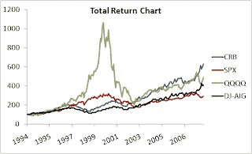

<!--yml
category: 未分类
date: 2024-05-12 23:15:12
-->

# Falkenblog: Equity Premium? Commodity Premium!

> 来源：[http://falkenblog.blogspot.com/2008/06/equity-premium-commodity-premium.html#0001-01-01](http://falkenblog.blogspot.com/2008/06/equity-premium-commodity-premium.html#0001-01-01)

One of the bigger puzzles in economics is the equity premium, the return you get for investing in equities over the risk free rate. This is considered too large by an order of magnitude given standard utility functions, which is really only a puzzle for those who know what a standard utility function is (very few). For most people, the estimates of 3.5% to 6.5% seem right, because investing in stocks is risky.

But what about commodities? Gorton and Rouwenhorst (2005) find that from 1959 through 2004, commodities had about the same return as equities. Harvey and Erb (2006) note much of this is from 'rebalancing', but such rebalancing in the liquid futures market seems eminently feasible. As commodities have gone through the roof in the past 3 years, that comparison only looks better for commodities. Using the CRB and DJ-AIG indices, they have about the same annualized volatility since 1994 as the S&P500, about 13%, but higher returns. They have much lower volatility than the Nasdaq. The Sharpe ratios for the S&P and Nasdaq have been around 0.38 since 1994, while the commodity indices are in the 0.50 to 0.70 range (the CRB is considerably higher. They weight energy, foodstuffs, metals, differently).

Further, the commodity indices have positive skew, while the equity indices have negative skew, and investors supposedly like positive skew, so they get this extra feature--and a premium!

Lummer and Siegel (1993) and Kaplan and Lummer (1998) argue that the long-run expected return of an investment in the cash collateralized commodity futures strategy should be similar to that of Treasury bills, equivalent to saying that the expected excess return should be zero. Dusak (1973) who documented low stock market betas and postulated low expected returns for wheat, corn and soybeans in the context of the Capital Asset Pricing Model of Sharpe (1964) and Lintner (1965). But I bet over the next few years we will have a bunch of papers explaining this strange 'commodity premium puzzle', which should be more puzzling than the equity puzzle ecause commodities are positively correlated with both inflation, and unexpected nflation, which like skew, are good things that should lower their returns. As there are lots of issues like rebalancing, and the futures 'roll', survivorship bias (poor futures become extinct), and weighting, the issue is not straightforward.

But as I noted in my

[post](http://falkenblog.blogspot.com/2008/06/rationalizing-versus-reasoning.html)

on Eliezer Yudkowsky, humans are good rationalizers, and I think most educated, smart people, rationalize as oppose to reason. If there's a risk explanation for this, it will take a lot of rationalizing indeed.