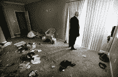

<!--yml
category: 未分类
date: 2024-05-12 23:13:14
-->

# Falkenblog: Extending Foreclosure Process Counterproductive

> 来源：[http://falkenblog.blogspot.com/2008/06/extending-foreclosure-process.html#0001-01-01](http://falkenblog.blogspot.com/2008/06/extending-foreclosure-process.html#0001-01-01)

Two foreclosure-related

[bills](http://www.foreclosure-fighter.com/new-legislative-updates.asp)

were recently cleared by a House committee, meaning they'll soon be up for vote before the entire House of Representatives. The bills would offer protection for homeowners facing foreclosure. Lengthening the time before a house could be given a foreclosure notice, and the time of pre-foreclosure (the time between the foreclosure notice and when the bank repossesses the house).

But this is totally counterproductive, because in this market a large number of houses were bought as investment properties, and people are walking away from them the second their value is less than the mortgage. More time won't get them to come back. With these new laws, the bank is hog-tied for up to 6 months from the last payment, before it can repossess the property. In the meantime,

[approximately 20% of these houses are stripped](http://www.sptimes.com/2008/02/19/Business/In_home_foreclosure__.shtml)

of

[everything](http://www.lasvegasnow.com/Global/story.asp?S=8534551&nav=menu102_2)

from appliances, doors, copper, aluminum siding, landscaping, toilets, and chandeliers--a rate sure to only rise if banks are precluded from repossessing quickly. In bad neighborhoods many of them become places for drug dealing and other activity that reduces property values. If you want to adversely affect neighborhood home values, put an abandoned property there for 6 months. The same governments that fret about abandoned homes and their collateral damage are simultaneously making it more common (see NPR story

[here](http://www.npr.org/templates/story/story.php?storyId=91400652&ft=1&f=1017)

, no mention of the foreclosure laws that preclude a bank's ability to get in their quickly).

Basically, a longer period of the foreclosure process implies a lower recovery rate. Who pays for lower recovery rates? Borrowers, specifically, poor borrowers. No one else. Banks lend money to make money, and they impute the expected probability of default, times the loss rate on the property (1- recovery rate), into future loans. If the

[foreclosure law](http://www.realtytrac.com/foreclosure/overview.html)

makes it harder for banks to repossess, more damage is done to the home, and so, a higher expected loss is put into new loans. And who does this hurt? Not the rich, they own their homes. Not those with good credit scores, because those whose default probabilities are less than 0.3% don't have much risk whether their home is worthless or not in such an improbable state (statistically). No, it is those with bad credit, the poor, those with lower levels of education, etc., who will pay, because if there's a 5% chance they will default, and the recovery rate is 25% lower because of new 'borrower friendly' legislation, that's a 1.25% increase the new, poor borrower will have to pay. As with so much economics, if you want to help the poor, this indirect route is not merely inefficient, it is counterproductive and unjust, because spillover effects from vacant properties are a pox on a community, and a new poor person shouldn't have to pay for a prior poor person's mistake.

In this mess, I would definitely go after predatory lenders who inflated appraisals, or who pushed a lot of ninja loans (ninja:

n

o

i

ncome verification,

n

o

j

ob

a

pplications). Operation

[Malicious Mortgage](http://www.fbi.gov/pressrel/pressrel08/mortgagefraud061908.htm)

is a good idea--there are bad guys out there that need to be held accountable. But the houses in default are spilled milk, and its best to have someone with skin in the game owning them ASAP. That would help poor borrowers, and poor neighborhoods, the most.