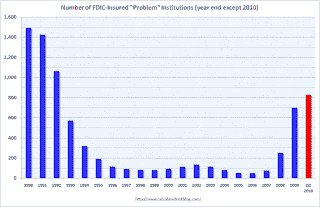

<!--yml
category: 未分类
date: 2024-05-12 21:22:36
-->

# Falkenblog: FDIC Problem Banks

> 来源：[http://falkenblog.blogspot.com/2010/09/fdic-problem-banks.html#0001-01-01](http://falkenblog.blogspot.com/2010/09/fdic-problem-banks.html#0001-01-01)

The FDIC keeps raising the number of 'problem' banks, kind of like Moody's lowering the rating on senior CMO tranches to BB when they are trading at less than 80% of par. They added a bar to this chart, now up to 829\. What, exactly, is a problem bank? On the FDIC website, we

[learn](http://www.fdic.gov/)

:

> Problem Banks - The FDIC creates reports on problem or troubled banks in the aggregate. We do not make the details of this list publicly available.

There's always a reason for decreased transparency, and it's always lame. You don't have to name names, but you can say with some specificity the criteria you are using, as opposed to the vague report given

[here](http://www.occ.treas.gov/prbbnkgd.pdf)

. Vagueness is never wrong, but its also never right. You might as well say, 'we used our collective common sense', but as common sense is inversely proportional to the size of the collective 'we', that insures it's classic hindsight risk attribution.

Problem banks were

[insignificant at the end of 2007](http://problembanklist.com/fdic-problem-bank-increase-puts-over-of-banks-at-risk-of-failure-0184/)

, when banks were all sitting on loans without any documentation, and built-in collateral appreciation assumptions. If our regulators did not see this, it's extremely naive to think they will foresee the next crisis. Charge-offs peaked in December 2009, and non-current loans peaked in March 2009, yet the number of problem banks continues to rise. Hindsight like this is giving economists and stock analysts a good name.