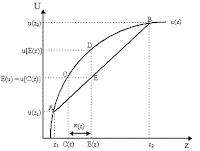
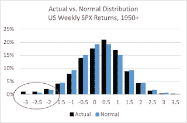

<!--yml
category: 未分类
date: 2024-05-12 19:58:53
-->

# Falkenblog: Factor Risk and Return

> 来源：[http://falkenblog.blogspot.com/2020/02/factor-risk-and-return.html#0001-01-01](http://falkenblog.blogspot.com/2020/02/factor-risk-and-return.html#0001-01-01)

Factor returns should reflect risk, in that they have traditionally been interpreted as proxies for some kind of risk not measured by beta. The idea is that perhaps what people really care about is whether there will be another oil shock, and nothing matters as much. Stocks that have a high dependence on cheap oil would have more risk than other stocks. In the early 1980s, this was a common hypothesis, though later people would add things like consumption growth and inflation.

Remember that our conception of risk comes from the idea that as utility functions are concave (have decreasing marginal utility), the higher the expected variance in our wealth, the lower the expected utility. Thus, $1 for certain tomorrow is worth more than a payoff with equal probabilities for {$0.50, $1.50}. Because of decreasing marginal utility, one enjoys an extra 50 cents less than one suffers from the 50 cent deficit, so you have to bribe people to make them indifferent to such an alternative, what is called the risk premium.

While most presentations of the CAPM use normal distributions, the initial creators did not simply jump on this assumption blindly because it was convenient, as there was a lot of focus on the best distributional assumption for asset returns.  I took the weekly returns and normalized them by a rolling volatility forecast to capture the heteroskedasticity (otherwise the tails are much fatter). While these deviations from normality are statistically significant, they aren't large. You can see the weekly returns are too frequent at the bottom, offset by the extra number of slightly-above-average returns.

Markowitz considered downside volatility and maximum drawdown among other metrics, and Eugene Fama's dissertation and several subsequent papers investigated the degree to which downside risk outside the normal distribution--aka fat tails--was the big driver. This was all motivated by Benoit Mandelbrot's documentation that many commodity markets had large downside tail returns. If you can get through

[this paper](https://pdfs.semanticscholar.org/d4bd/6df2ba1df56677097ef8fc09a72b74ade910.pdf)

 by Fama (1965), you'll understand why he stopped investigating it: it's boring. [In contrast, the degree to which market crashes overstate 'average' returns is much more interesting, see

[Barro (2005)](https://www.nber.org/papers/w11310.pdf)

. But note, this is all about whether the average equity return premium should be reduced by 3%, not a criticism of the CAPM or its spawn.]

You can capture the above deviation from normality in many different ways but they don't add much of any practical value.

[Levy and Markowitz (1979)](https://www.researchgate.net/profile/Haim_Levy/publication/4979832_Approximating_Expected_Utility_by_a_Function_of_Mean_and_Variance/links/567d150908ae1e63f1e5de9f/Approximating-Expected-Utility-by-a-Function-of-Mean-and-Variance.pdf)

documented that the gaussian distribution, for all its faults, is pretty innocuous. All you have to do is increase a person's risk aversion so that they 'feel' the downside risk more strongly, and you capture the effects of fat declines just as you would with some mixed distribution with more parameters. The costs are low, but the benefits are large. Normal distributions are additive (one normal plus another is still normally distributed), which makes statistics a lot easier. A mere 2 parameters describe the entire distribution (all the higher moments are linear functions of the mean and variance). Further, when x is normally distributed, E[e

^x

]=e

^(μ+1/2σ²)

, which is useful in all sorts of models (eg, exponential utility is of the form 1-e

^(-αx)

).

I pulled a bunch of portfolio factor data from Ken French's

[website](http://mba.tuck.dartmouth.edu/pages/faculty/ken.french/data_library.html)

. It's an awesome resource for anyone into equity risk because it's free and easy to access (no sign-ins or passwords).  For the US I pulled seven factors, the high and low quintiles among the largest 2 size quintiles, for 7 factors: book/market, cashflow/price, earnings/price, volatility, investment (asset growth), prior returns, and accruals.

As a practical matter, most metrics of risk are correlated. Beta and portfolio volatility have incredibly high correlations, so much so they are almost redundant. Minimizing beta or vol is basically the same thing.  The correlation between portfolio volatility and the maximum drawdown is not as high, but still highly significant. To the degree risk is the expected worst-case scenario, volatility/beta should capture a good deal of this.

When we look at the relationship between these risk metrics for various factor portfolios, there is nothing close to a strong correlation. Indeed, the correlation is negative to a first approximation.

For international portfolios, I used book/market, cashflow/price, and earnings/price from several regions. For these, I normalized by subtracting the region-specific volatility and average returns, so that factor performance is comparable.  While risk is no longer negatively correlated with returns, the correlation is weak.

Factor risk premiums do not reflect risk, they explain themselves. Perhaps they are capturing something institutional, like taxes. I came across Phil DeMuth's latest book, The

[Overtaxed Investor](https://www.amazon.com/Overtaxed-Investor-Slash-Your-Alpha/dp/0997059605)

, and he emphasizes the tax advantage of capital gains over dividends. Now if in equilibrium investors have to be indifferent, perhaps the extra 2% earned by high dividend stocks is compensated by the higher tax rate. Transaction costs could be another issue, especially for small-cap stocks, in that it may cost one a couple of percent more to get in and out of these positions, which would not be reflected in end-of-day returns but would your for small-cap investor. Such explanations have nothing to do with risk.

In the latest American Finance Association

[Presidential Adress](https://papers.ssrn.com/sol3/papers.cfm?abstract_id=3513210)

, David Hirshleifer presented the following theory by way of an analogy. Moths (supposedly) fly into flames kamikaze-style, as they are hard-wired to fly towards the moon to get their bearings. Clearly, this isn't good for the moths, but rather, a rule-of-thumb that does not extrapolate well, especially after man discovered fire. Perhaps our monkey brains have similar lacunae. For example, many remember dating someone crazy because she was super hot, not because men like crazy girls, but rather, crazy girls do hot things that cause men's limbic system to shut down the cerebral cortex (this is now a meme, but young fools will only learn by experience). Similarly, investors could be attracted to risk, not directly, but rather, the fact that risky stocks have attractive attributes like stories about transforming the workplace, or they have pot-smoking CEOs, or that they specifically focus more on marketing to investors as opposed to consumers.

While I agree with most people that many investors are ignorant and susceptible to biases, these suboptimal decision-makers are a poor explanation for equilibrium asset prices; their bad decision-making is mainly evinced by excessive trading. It doesn't take many smart traders to figure out that if they steel themselves against those risky-stock promoters they can make large risk-adjusted returns. It's not complicated, you don't have to tie yourself against a mast like Odysseus, just don't listen to conference calls or watch CNBC, and instead just crunch datasets where all you know about ABC corp are its objective metrics.  Then buy the wallflower stocks and sell the crazy/hot ones. Arbitrageurs should counteract behavior biases in asset markets with free entry.

Biases, departures from normality, and new factors don't explain why anything reasonably correlated with something related to wealth volatility has no correlation with average returns. This leaves the utility function. With relative risk, there should be no risk premium just as there isn't one. This makes factor investing much less attractive because, without the risk adjustment that accentuates the alpha, you just have the potential for making 2% extra but have to take on more risk to do so (by deviating from the market, creating benchmark risk).  It's not like there are $20 bills lying on the floor, but rather, a bunch of change in a fountain, and you can grab a handful if you don't mind getting soaking wet and mean looks.