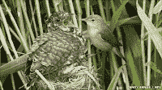

<!--yml
category: 未分类
date: 2024-05-12 20:36:52
-->

# Falkenblog: Fascinating Evo Biology lecture

> 来源：[http://falkenblog.blogspot.com/2012/01/fascinating-evo-biology-lecture.html#0001-01-01](http://falkenblog.blogspot.com/2012/01/fascinating-evo-biology-lecture.html#0001-01-01)

[Anna Dornhaus](http://www.dornhaus.de/)

gave an interesting

[lecture](http://cos.arizona.edu/mind/)

on evolutionary biology. I really like this thread ever since I read

The Selfish Gene

but am finding the stories repetitive, so these were all fresh. Here's some of her stories.

Warblers are very good at

[detecting which of their eggs](http://news.bbc.co.uk/earth/hi/earth_news/newsid_9203000/9203476.stm)

are cuckoo eggs, something that is not detectable from a casual glance. Cuckoos know they have to at least remove one of the Warbler eggs before adding their own, so the competition is clearly into overdrive. Yet, occasionally the Warblers are fooled into letting the Cuckoo egg stay, and once hatched the Warbler raises the behemoth Cuckoo even though it looks nothing like its siblings (3 times the size, different color). It seems conscious minds can only afford to be so discriminating in certain areas, the rest apply simple rules.

Minds aren't good at detecting things that never happen in nature. Omnivores like rats are good at figuring out what foods are not good for them, using the simple rule that if they get sick, anything they ate 2 hours ago is no longer considered tasty. Vampire bats only drink blood, and as blood is basically never poisonous, if you do poison the blood to make the bats sick, they will never associate it with the blood from that source. They can't make the connection because from an evolutionary perspective, it basically doesn't happen.

Different species of sticklebacks live in the bottom and top of lakes. The top-dwelling sticklebacks can't learn landmarks.

[It appears](http://www.mendeley.com/research/sympatric-species-threespine-stickleback-differ-performance-spatial-learning-task/)

the bottom dwelling fish are very good at detecting landmarks, while the top-dwelling fish looks more at how things behave. So perhaps skills not useful in their evolutionary past are eventually lost. On the other hand, female birds are not very good at remembering where they stored food when they have mated because they rely on their mate. Unmated females, however, are just as good as the males at remembering seed caches. I imagine one could therefore argue top-dwelling sticklebacks failed their spatial geometry quiz because it had no value to them.

Some animals grow the brain during the part of he year they need it more, and then lose that in the part when they are less cognitively demanding part of the year. More evidence for the use it or lose it principle.

Interestingly, scientists

[bred fruit flies for intelligence](http://nootropics.com/misc/smartflies.html)

. They made bananas taste bitter, which fruit flies don't like. They then gave the flies little markers, so the 'smart' ones would avoid the bitter bananas based on this learned signal, the dumb ones would not. After only 20 generations they generated 'smart' and 'dumb' fruit flies who could learn at different success rates. Then, they mixed them together and saw what happened:

[Idiocracy](http://en.wikipedia.org/wiki/Idiocracy)

, the dumb flies out-reproduced the smart ones! Her take-away was intelligence is costly, and everything has trade-offs.

I especially like the idea that any ability comes with trade-offs and so in a sense we are all idiot-savants, good at some things, bad at others, especially with respect to really different people. I know a lot of smart people, but I've never met one who didn't have blind spots. It's good to remember that because if you think that because you have a really high IQ, are really rich, or are a good speaker, you are therefore the smartest guy in any room, you are going to make a very big mistake someday.