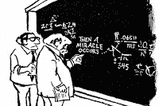

<!--yml
category: 未分类
date: 2024-05-12 19:58:15
-->

# Falkenblog: Fermi's Intuition on Models

> 来源：[http://falkenblog.blogspot.com/2020/04/fermis-intuition-on-models.html#0001-01-01](http://falkenblog.blogspot.com/2020/04/fermis-intuition-on-models.html#0001-01-01)

In

[this](https://www.youtube.com/watch?v=hV41QEKiMlM)

video snippet, Freeman Dyson talks about an experience he had with Enrico Fermi in 1951\. Dyson was originally a mathematician who had just shown how two different formulations of quantum electrodynamics (QED), Feynman diagrams and Schwinger-Tomonoga's operator method, were equivalent. Fermi was a great experimental and theoretical physicist who built the first nuclear reactor and discovered things like neutrinos, pions, and muons.

Dyson and a team at Cornell were working on a model of strong interactions, the forces that bind protons and neutrons in the nucleus. Their theory had a speculative physical basis: a nucleon field and a pseudo-scalar meson field (the pion field), which interacted with the proton. Their approach was to use the same tricks Dyson used on QED. After a year and a half, they produced a model that generated a nice agreement with Fermi's empirical work on meson-proton scattering he had produced at his cyclotron in Chicago.

Dyson went to Chicago to explain his theory to Fermi and presented a graph showing how his theoretical calculations matched Fermi's data. Fermi hardly looked at the graphs, and said,

> I'm not very impressed with what you've been doing. When one does a theoretical calculation there are two ways of doing it. Either you should have a clear physical model in mind, or you should have a rigorous mathematical basis. You have neither.

Dyson asked about the numerical agreement between his model and the empirical data. Fermi then responded, 'how many free parameters did you use for the fitting?'  Dyson noted there were four. Fermi responded, 'Johnny von Neumann always used to say with four parameters I can fit an elephant, with five I can make him wiggle his trunk. So I don't find the numerical agreement very impressive.'

I love this because it highlights a good way of looking at models. A handful of free parameters can make any model fit the data, generating the same result as a miracle step in a logical argument.  Either you derive a model from something you know to be true, or you derive them from a theory with a clear intuitive causal mechanism.

The entire interaction took only 15 minutes and was very disappointing, but Dyson was blessed with the wisdom and humility to take Fermi's dismissal as definitive and went back to Cornell to tell the team they should just write up what they had done and move on to different projects.

While this was crushing, with hindsight Dyson was grateful to Fermi. It saved his team from wasting years on a project that he discovered later would have never worked. There is no 'pseudo-scalar pion field.'  Eventually, physicists replaced the pion with 2 quarks, of which there are 6, highlighting the futility of the physical basis of their approach. Any experimental agreement they found was illusory.

After this experience, Dyson realized he was best suited to simplify models or connecting axioms to applications like quantum field theory. What was required for the strong interactions at that time was not a deductive solution but an invention--in this case, quarks--and that requires strong intuition. He realized his strengths were more analytic, less intuitive.

Unfortunately, today our best scientists are unconcerned about the ability of free parameters to make a bad theory seem fruitful. In physics, we have inflation, dark matter, and dark energy, things that never been isolated or fit into the Standard Model. In climate science, an anachronistic and clearly wrong Keynesian macro-model is one of many components (e.g., atmospheric, ocean, vegetation). They fit known data well but are totally unfalsifiable.