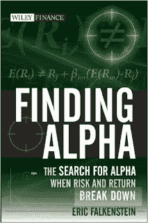

<!--yml
category: 未分类
date: 2024-05-12 20:00:48
-->

# Falkenblog: Finding Alpha pdf

> 来源：[http://falkenblog.blogspot.com/2016/08/finding-alpha-pdf.html#0001-01-01](http://falkenblog.blogspot.com/2016/08/finding-alpha-pdf.html#0001-01-01)

My book

[The Missing Risk Premium](https://www.amazon.com/dp/B0098CXN46)

is a steal at only $15, but my first book,

[Finding Alpha](https://www.amazon.com/Finding-Alpha-Search-Return-Finance-ebook/dp/B002D9ZL0U)

, is a $65, which is a bit much for anyone not expensing their books. Finding Alpha goes over why the current asset pricing model fails, with lots of evidence, explains why economists still like it, and then in chapters 10-13 shows concrete examples of how investors have actually found alpha.

The risk begets return theory is 100 degrees wrong: usually it generates a wrong sign, but often no correlation. When it does work it's like when the CAPM appeared to work in the 1970s, an omitted variables problem (ie, size effect & bias).

The fact that it should work but doesn't implies there's a something really rotten in economics, because it's not like you can add a skew preference and fix this (this is because if the skew preference has a sizeable effect, investors are not globally risk averse, which then turns everything upside down).  There's plenty of wrong stuff people learn in economics or college in general, but most such errors are clearly based on some left-right ideology, and this is not the case here.

You can download the individual chapters in pdf form here...

<select id="chapter" name="chapter"><option value="contents" default="">Contents</option> <option value="chapter-1">Chapter 1 Risk Uncorrelated with Returns</option> <option value="chapter-2">Chapter 2 The Creation of the Standard Risk-Return Model</option> <option value="chapter-3">Chapter 3 The Empirical Arc</option> <option value="chapter-4">Chapter 4 Volatility, Risk and Returns</option> <option value="chapter-5">Chapter 5 Investors do not Mind their Utility Functions</option> <option value="chapter-6">Chapter 6 Is the Equity Risk Premium Zero?</option> <option value="chapter-7">Chapter 7 Undiminished Praise of a Vacuous Theory</option> <option value="chapter-8">Chapter 8 Why Relative Utility Generates Zero Risk Premiums</option> <option value="chapter-9">Chapter 9 Why We are Inveterate Benchmarkers</option> <option value="chapter-10">Chapter 10 Alpha, Risk, and Hope</option> <option value="chapter-11">Chapter 11 Examples of Alpha</option> <option value="chapter-12">Chapter 12 Alpha Games</option> <option value="chapter-13">Chapter 13 Alpha Seeking Applications</option> <option value="chapter-14">Chapter 14 Conclusion</option> <option value="references">References</option></select>