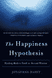

<!--yml
category: 未分类
date: 2024-05-12 23:05:51
-->

# Falkenblog: Flattering Self Portraits

> 来源：[http://falkenblog.blogspot.com/2008/07/flattering-self-portraits.html#0001-01-01](http://falkenblog.blogspot.com/2008/07/flattering-self-portraits.html#0001-01-01)

I've often read that most people consider themselves above average drivers, or have above average leadership skills. Further, this bias is worse the more educated you are, though presumably we think only because it's more true.

But Jonathan Haidt's delightful book,

[The Happiness Hypothesis](http://www.happinesshypothesis.com/)

, introduces me to another such manifestation. Its seems when you artificially enhance someone's picture to be objectively more attractive, they pick their image out of a collage faster than if it is not enhanced. We recognize ourselves faster when we look more attractive than we actually are.

The book has what must be a dig at the

[Freakonomics Spawn](http://falkenblog.blogspot.com/2008/04/why-freakonomics-craze.html)

, when Haidt notes:

> Proving that people are selfish, or that they'll sometimes cheat when they know they won't be caught, seems like a good way to get an article into the Journal of Incredibly Obvious Results. What's not so obvious is that, in nearly all these studies, people don't think they are doing anything wrong. From the person who cuts you off on the highway all the way to the Nazis who ran the concentration camps, most people think they are good people and that their actions are motivated by good reasons.

Best book I've read in at least a year.