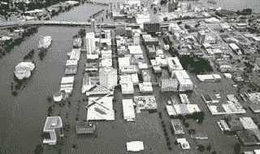

<!--yml
category: 未分类
date: 2024-05-12 23:14:33
-->

# Falkenblog: Floods in Iowa

> 来源：[http://falkenblog.blogspot.com/2008/06/floods-in-iowa.html#0001-01-01](http://falkenblog.blogspot.com/2008/06/floods-in-iowa.html#0001-01-01)

Lots of

[flooding](http://online.wsj.com/article/SB121346667450175165.html?mod=hps_us_whats_news)

in Iowa, and it looks like a mess. But it is most notable for its lack of mayhem and looting, in contrast with Katrina, which was like the second floor of a frathouse party, people operating without a super-ego. I think this is what Steve Levitt would call, a natural experiment. What is the difference? Population density? Poverty rates? FEMA's response? The state's response?

The standard narrative on the Left is that Bush's incompetence and indifference was a primary cause of the social meltdown observed in Katrina's aftermath. I think that gives the President way to much blame. A comparison with these other disasters would be a good Master's thesis.