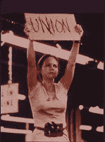

<!--yml
category: 未分类
date: 2024-05-12 22:01:02
-->

# Falkenblog: Freudian Slip

> 来源：[http://falkenblog.blogspot.com/2009/05/freudian-slip.html#0001-01-01](http://falkenblog.blogspot.com/2009/05/freudian-slip.html#0001-01-01)

Ron Gettlefinger, head of the UAW,

[thinks the auto companies are worthless](http://money.cnn.com/2009/05/19/news/companies/uaw_ownership/index.htm?postversion=2009051911)

:

> The UAW is set to receive a 55% stake in Chrysler through its union trust fund once that automaker emerges from bankruptcy. The trust fund will also likely get up to 38% of GM's stock as part of its reorganization.
> 
> But that doesn't mean the union will be calling the shots at either company. In fact, UAW president Ron Gettelfinger said the union hopes to sell its stake in both companies quickly because he is more interested in raising cash to cover retiree health care costs than having an ownership stake in GM (GM, Fortune 500) and Chrysler.
> 
> "Let somebody else take the stock. Give us the money," Gettelfinger said at a recent press conference. "We are trading debt for equity, and what is the value of the equity? Let's be honest, it's zero today."

So, they have an offer for large blocks of stock they think are worth zero. As they are the union that dominates the cost structure at those companies, they can make it happen. Takers?