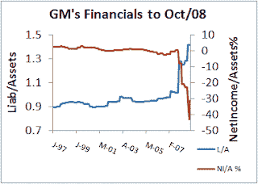

<!--yml
category: 未分类
date: 2024-05-12 21:16:04
-->

# Falkenblog: GM Zombie Reanimated

> 来源：[http://falkenblog.blogspot.com/2010/11/gm-zombie-reanimated.html#0001-01-01](http://falkenblog.blogspot.com/2010/11/gm-zombie-reanimated.html#0001-01-01)

GM supposedly sold stock today that implies a current p/e around 6.2 (earnings around $8B, market cap around $50B), compared to Ford at 8.3\. I am confident GM will fail in the long run, but that's a long time from now.

GM was a money loser for years, and when you considered their off-balance sheet liabilities, insolvent since the early 1990's. In June 2009 the equity owners were finally basically wiped out, and bond owners got about 15% of their principal. The new GM bought many of the assets and the trademark "General Motors" from the old company, has many of the same employees, and sells many of the same brands. Basically, it's the same company, just without all those pesky liabilities (debt went from $97B to $17B)!

Looking above, you can see their 'official' Liabilities/Asset ratio was pretty stable around 0.90 for a decade prior to the financial crisis. With creative accounting, they looked viable, until the losses made this impossible. Currently, the liabilities/assets ratio is around 0.80, and this is a much 'cleaner' number because many of the overvalued assets were transferred to the US Treasury. Given Ford's Liab/Asset ratio is around 1.03, I'd say GM is a better buy for the same price-earnings ratio, meaning: buy GM/sell F.

Just don't put it in your kid's college fund into GM and forget about it. GM didn't die due to bad luck, their cost structure was and still is not competitive with the Japanese. In the same way that a spendthrift whose rich dad pays off his credit cards every so often has no incentive to become frugal, GM has no need to make hard decisions. It will survive one, maybe two, recessions.