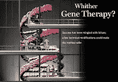

<!--yml
category: 未分类
date: 2024-05-12 22:29:36
-->

# Falkenblog: Geron up 50% on Hope

> 来源：[http://falkenblog.blogspot.com/2009/01/geron-up-50-on-hope.html#0001-01-01](http://falkenblog.blogspot.com/2009/01/geron-up-50-on-hope.html#0001-01-01)

The WSJ

[noted](http://online.wsj.com/article/SB123268485825709415.html)

:

> Geron Corp., a Menlo Park, Calif., biotechnology company, is expected to announce Friday that it received a green light from the agency to mount a study of its stem-cell treatment for spinal cord injuries in up to 10 patients.

Geron (GERN) rose about 50% since Thursday on this news. They have a market cap of around $600MM, and have never posted a profit.

Now, if stem cell therapy was kept down by the unilateral dictates of George Bush, and this artificial constraint is now lifted, one might say this is purely rational exuberance. But there are almost 100 adult stem cell

[therapies in existence](http://www.corcell.com/expectant/diseases_treated.html#current)

, since 1968! After 40 years, I think we have good reason to think we have picked the low hanging fruit in stem cell therapies. After all, while Bush limited the Federal funding of several embryonic stem cell lines, states were free to fund them (and did), as well as private and foreign governments. In other words, this is not a field devoid of attention.

The difference between embryonic and adult stem cells is mainly theoretical, that because embryonic cells are from prior to much tissue differentiation, they should be more plastic than adult stem cells. In practice, adult and embryonic stem cells behave rather similarly, and the hidden premise of proposals for stem cell therapy is that we needn't understand exactly what is going on because if you just put the cells in the right place they will know what to do (the

[Proteus Effect](http://www.amazon.com/Proteus-Effect-Cells-Promise-Medicine/dp/0309097371)

), like dropping

[Doctors without Borders](http://www.msf.org/)

in the middle of the war-torn Congo. These cells sense when something needs help like damaged nerve, cardiac, or pancreas cells, and make replacement cell parts, if not replacement cells.

I have no ethical qualms against using embryonic stem cells, and think Bush was wrong to restrict this research. But I also think he is assumed to have way too much power, because it is not like he stamped out closely related research, and there have always been other areas that would allow and fund embryonic stem cell research. Sure, '

[the long-term promise is boundless](http://www.time.com/time/magazine/article/0,9171,1220538-3,00.html)

', which is great upside if ever, but they also 'show a dismaying talent for turning into tumors', which is bad. If California got $4B to spend on this in 2004, Massachusetts got $1.25B in 2007, and nothing has yet come of it, what are the odds this company will figure it out by the time investors get tired? Possible, yes, probable, no.

When a science generates a potential solution and such solutions are touted as if they have never been tried after decades, I think it is probable they don't work (eg, see behavioral finance, fractals in finance, Keynesian stimulus, neural nets, artificial intelligence).