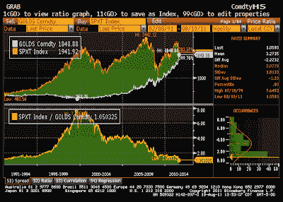

<!--yml
category: 未分类
date: 2024-05-12 20:47:41
-->

# Falkenblog: Gold vs. SP500

> 来源：[http://falkenblog.blogspot.com/2011/08/gold-vs-sp500.html#0001-01-01](http://falkenblog.blogspot.com/2011/08/gold-vs-sp500.html#0001-01-01)

If you would have bought Gold (the white line) at any time since 1991, it would have been a better investment than the Standard and Poor's 500 index (orange line), with a lot less volatility.