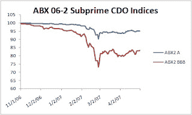

<!--yml
category: 未分类
date: 2024-05-12 21:35:30
-->

# Falkenblog: Goldman Busted on This One

> 来源：[http://falkenblog.blogspot.com/2010/04/goldman-busted-on-this-one.html#0001-01-01](http://falkenblog.blogspot.com/2010/04/goldman-busted-on-this-one.html#0001-01-01)

Today, the SEC

[filed a complaint](http://www.nytimes.com/2010/04/17/business/17goldman.html)

alleging that Goldman Sachs, and employee Fabrice Tourre, defrauded investors by failing to disclose that the party that picked the securities underlying a CDO was doing so to short it (Paulson & Co.). Their stock is down some 20%. In general, investment banks were caught up in the housing delusion with everyone else, which is why they too suffered so much in the meltdown. This transaction, however, is quite different.

As laid out in the SECs brief, Goldman and Tourre knew that Paulson was trying to create a CDO Paulson could then short. In effect, Goldman was the clearing house, taking merely a fee, while Paulson and the CDO buyers would have a future's type payoff. So, Goldman didn't really care what happened, they just wanted a deal done, to get fees. What makes this so special is that this deal was constructed when the first cracks were showing in the market, as the

[ABX Subprime CDO index](http://www.markit.com/en/products/data/indices/structured-finance-indices/abx/abx-prices.page?)

started to falter in November 2006, and fell precipitously in February 2007\. Internal emails indicate they were well aware the market was going down, and this was one of the last deals (the deal was presented to the relevant parties in January, and closed on April 26, 2007). On March 7, 2007, there was a

[BusinessWeek article](http://www.businessweek.com/investor/content/mar2007/pi20070308_900631.htm)

on how Paulson & Co was making a fortune off shorting subprime CDOs, which were then showing massive signs of danger.

Goldman and Tourre got another company with a solid reputation, ACA, to be the official sponsor, because they knew no one would buy a CDO assembled by a short--too much opportunity to cherry pick the bad bonds. You don't need to do as much due diligence when you think the other parties involved have a consistent interest in your portfolio, so a sponsor with long-only interest is rather essential for such complex deals. Goldman told ACA that the collateral was picked by Paulson which would then hold the equity stake in the transaction. In fact Goldman knew Paulson had no such plans and wanted a vehicle to short, and as mentioned, there were articles discussing Paulson's shorting of subprime CDOs, so ACA was incredibly deaf. Nonetheless ACA was mislead (ACA soon basically failed, so they got their just reward).

In securities markets, people often buy from those who think the price will fall. Yet in this case the seller's intention was material because when there is incomplete information, knowing the intentions of the parties involved makes a huge difference. I know from my litigation experience, that appropriate tactics are vastly different when dealing with parties who have good faith, versus parties with bad faith. Intentions, motivations, go a long way in explaining things, but the problem with blaming intentions is they are usually impossible to determine objectively, and so best ignored. In this case, the portfolio was constructed by a short seller so the intentions are pretty clear. Whether there's a law against this, I'm not sure, but it's pretty bad business.

While I think Tourre and Goldman deserve a smacking for this, it should be recognized that this kind of deal is not representative, and that most CDOs were created by people who sincerely, if stupidly, thought they were good deals. Note that Paulson is one of the few hedge funds that really cleaned up in this mess, most hedge funds missed it with everyone else. If shorts were primary drivers of CDO demand, this would suggest a giant conspiracy, so it's the proportion, not the principle, which leads me to think that understanding the 2008 credit crisis via these kind of deals is misleading.

Note: Goldman

[fires back](http://www2.goldmansachs.com/our-firm/press/press-releases/current/sec-response.html)

, disputing the main point of evidence for the SEC, that Goldman told Abacus manager ACA that Paulson was the equity owner. I think that is the most important fact in the case, and is either true or false. Goldman does note that since they lost $90MM on the deal, and ACA lost almost $1B, they actually did think it was a good deal, which makes sense. Even if they are not guilty, they were really short sighted, and Fab Tourre is either an idiot or a scumbag, and Goldman is stupid or scumy for hiring guys like that.