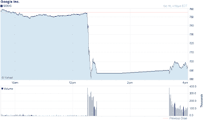

<!--yml
category: 未分类
date: 2024-05-12 20:20:27
-->

# Falkenblog: Google Stop Per Regulations

> 来源：[http://falkenblog.blogspot.com/2012/10/google-stop-per-regulations.html#0001-01-01](http://falkenblog.blogspot.com/2012/10/google-stop-per-regulations.html#0001-01-01)

Google had a PR snafu and announced earnings intraday. This caused a big price move of 10%, and then a price freeze for about 2 hours per US regulations.

To think this had any help on generating a more efficient market is absurd. This disruption wasn't horrible but highlights the futility of trying to do good: such regulations always ends up something really dumb that just annoys everyone in the know.