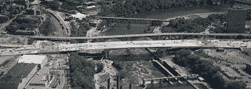

<!--yml
category: 未分类
date: 2024-05-12 22:57:59
-->

# Falkenblog: Governments Like Pyramids

> 来源：[http://falkenblog.blogspot.com/2008/09/governments-like-pyramids.html#0001-01-01](http://falkenblog.blogspot.com/2008/09/governments-like-pyramids.html#0001-01-01)

The first rule of governing is to take credit for things. The problem is, so much under government's thumb is a synonym for 'decrepit': public parks, public schools, public bathrooms, public golf courses. So, the occasion bright shiny monument is very helpful, especially if you can add a touch of pathos by aligning them with conspicuous suffering--such as from horrific accidents or terrorist attacks.

Thus, after last year's wacky bridge collapse here in Minnesota, where 13 people died, and 100 were injured, the government responded quickly to create a

[new bridge](http://projects.dot.state.mn.us/35wbridge/)

. And this Thursday it will open. See pick above.

But this is only about 1/4 mile across. It

[cost $261MM](http://www.startribune.com/local/18553754.html)

to build, which was no problem for the state government, because the Federal government is paying the bill. Thus, they chose the most expensive bid, for reasons that are not entirely clear. The unions have big billboards proclaiming how proud they are to build this bridge. This is

[syndicalism](http://en.wikipedia.org/wiki/Syndicalism)

in action (a favorite of Noam Chomsky). Just have little monopolies provide services and products at inflated prices, and take credit for the high quality of the work, and the high incomes available to all the workers. The fact that such expense means fewer bridges, etc., can ever be built, is not your problem.