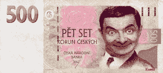

<!--yml
category: 未分类
date: 2024-05-12 21:33:28
-->

# Falkenblog: Greek Calculus

> 来源：[http://falkenblog.blogspot.com/2010/05/greek-calculus.html#0001-01-01](http://falkenblog.blogspot.com/2010/05/greek-calculus.html#0001-01-01)

The Greek bailout is rather depressing, but I'm empathetic. As

[Reinhardt and Rogoff](http://falkenblog.blogspot.com/2010/04/reinhart-and-rogoff.html)

show, a financial crisis increases real government debt an average of 86% of GDP (this is noted five separate times in their book 'This Time It's Different' on the history of financial crises, so it's the #1 fact of financial crises). Think of this as the cost of letting a crisis happen. On the other hand, there is the cost of continuing to overspend, which also adds to the debt, and further signals to others that they too need not discipline their budgets. The hope is that the bailed-out party will amend its ways and not need a further bailout down the road--clearly, this isn't usually the case.

So, it's a trade-off, and it's benefits would depend a lot on intrinsically subjective probabilities. Reasonable people can disagree.