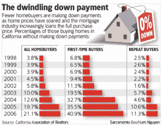

<!--yml
category: 未分类
date: 2024-05-12 22:51:34
-->

# Falkenblog: Greenspan's Other Admission

> 来源：[http://falkenblog.blogspot.com/2008/10/greenspans-other-admission.html#0001-01-01](http://falkenblog.blogspot.com/2008/10/greenspans-other-admission.html#0001-01-01)

Every 10 years or so, there is a financial crisis somewhere in the global system, and this is always galvanizes critics of capitalism. For A.J.P. Taylor notes that in the aftermath of the now-forgotten financial crisis of 1873: “The German political leaders, capitalists or the associates of capitalists, were discredited by the financial scandals, which, as always, accompanied the collapse of economic optimism” (p. 151,

[The Habsburg Monarchy](http://www.amazon.com/Habsburg-Monarchy-1809-1918-Austrian-Austria-Hungary/dp/0226791459)

, 1809-1918).

Thus, our current crisis is bringing forth a bunch of partisan arguments, suggesting a lack of regulation, or too much government meddling, was the essence of the problem. As we clearly had a lack of regulation on the key risk contributors, one could plausibly argue either, as ‘more’ regulation may have mitigated the problem, but it may also have encouraged greater misplaced lending under the goal of increasing home ownership. I imagine that debate will not be definitively answered, just as the causes of the financial crises of 1893, 1907, 1929-33, 1974, 1998 are hardly settled matters among economic historians.

In Greenspan’s

[testimony](http://oversight.house.gov/documents/20081024163819.pdf)

in front of congress last week, he noted:

> And we have this extraordinarily complex globa1 economy which, as everybody now realizes, is very difficult to forecast in any considerable detail. Mr. Chairman, I know I agree with you in the fact that there are a lot of people who raised issues about problems emerging. But there are always a lot of people raising issues, and half the time they are wrong. And the question is, what do you do?

Indeed. The problem we have is that in a complex system there are several potential causes, so reversing their ‘true’ value given the failure of the system is a problem with more variables than observations. A 'successful' warning of a failure might be unhelpful in constructing a solution for two very different reasons:

1) The failure forecast was part of a general, unspecified prection. To that ‘something financial will crash’ covers banks, bonds, currencies, oil, a group so diverse, it suggests a meta-problem in asset markets. If you have been predicting a general crisis for, well, ever, you can hardly be called prescient. To the extent there is a breakdown in the general milieu such as too much greed, or not enough regulation, seems sufficiently unfocused to be of little help.

2) The failure was correct on the area that failed (eg, banks, mortgages), but had a wrong cause. Of those who warned about he problems with Fannie and Freddie, most focused on the interest rate risk, not credit risk.

Stan Liebowitz, who had targeted the lowering of underwriting standards in the amid 1990’s, was validated a decade later, but his focus was not the center of, say, the Republican criticisms of Fannie an Freddie in the 2005 proposal for more regulation of those institutions. He

[notes](http://papers.ssrn.com/sol3/papers.cfm?abstract_id=1211822)

that “prior to 2006 What you will not find, if you read the housing literature from 1990 until 2006, is any fear that perhaps these weaker lender standards that every government agency involved with housing tried to advance… might lead to high defaults, particularly if housing prices should stop rising”. In other words, the key to this problem, the essence of what caused mortgages to crash, was crazy lending standards, but no prominent people were highlighting these risk before the fact. But what is most insidious is that this error was made by everyone: originators, rating agencies and investment banks, investors. All along the chain, people with very different incentives and objectives ignored this risk. It is easy to see how Moody's dropped the ball, but if the issuers wanted AAA ratings, and the investors wanted both AAA ratings, and stable ratings, Moody's just gave them what they wanted. How could they all have been so blind to the problem suggested by the data below (from

[Dr. HousingBubble](http://www.doctorhousingbubble.com/saving-money-is-for-economic-girlie-men-5-reasons-why-the-united-states-government-wants-you-to-remain-a-broke-debt-hamster/)

)? I don't think it's so easy as saying they were greedy, or overconfident.

Just as no rational terrorist would today try to take down a plane with box-cutters—because passengers would see the end game and thus be highly motivated to overtake them at very quickly, unlike prior to 9/11/01—the problem created by high risk mortgages is not something that needs Washington’s help at this moment. The market for these securities no longer exists. Indeed, the solution to create a new Department of Homeland Security Department, with its Transportation Safety Administration, may be just wasteful bureaucratic bloat, less able to respond to new risks.

As Greenspan

[noted](http://oversight.house.gov/documents/20081024163819.pdf)

:

> And the reason essentially is that a financial crisis must of necessity be unanticipated, because if it is anticipated, it will be arbitraged away, and if a financial crisis by definition is a discontinuity in asset prices, then it means from one day to the next people were surprised. Something fundamentally different happened. I think that, and I have argued this, and I am not saying whether the government resources are relevant to this, I think the academic community could do it surely as well. And what we do have to understand is that our view of the way an economy functions is not properly modeled by what we now have.

This highlights that we should be very cautious in fixing this problem, because the new laws and government agencies, once created, are usually there for a generation at least.