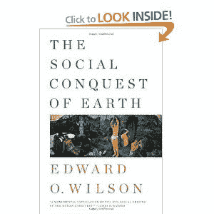

<!--yml
category: 未分类
date: 2024-05-12 20:30:05
-->

# Falkenblog: Group Selection Makes a Comeback

> 来源：[http://falkenblog.blogspot.com/2012/05/group-selection-makes-comeback.html#0001-01-01](http://falkenblog.blogspot.com/2012/05/group-selection-makes-comeback.html#0001-01-01)

E.O. Wilson's latest book The 

[Social Conquest of Earth](http://www.amazon.com/Social-Conquest-Earth-Edward-Wilson/dp/0871404133)

is a relatively short, profound read on group selection. Wilson is the famed myrmecologist whose book

[Sociobiology](http://en.wikipedia.org/wiki/Sociobiology:_The_New_Synthesis)

really got the evolutionary biology field going in the seventies. This is a rather major intellectual revolution, as there used to be conensus that group selection was empirically irrelevant (Dawkin's

[Selfish Gene](http://en.wikipedia.org/wiki/The_Selfish_Gene)

) and also immoral (The

[Frankfurt School](http://en.wikipedia.org/wiki/Frankfurt_school)

, see Ursula Goodenough

[here](http://www.youtube.com/watch?v=fp2VRHvHY0M)

call ethnocentrism a 'bullshit' instinct). Now its seen as relatively important, and has good and bad sides we simply will have to deal with.  Jon Haidt argues we are more groupish than selfish, and I think that's a pretty empirically important fact if true.

 I think it's important for everyone to realize they have important, idiosyncratic connections: family, neighbors, colleagues, and for some religion and race. My parents taught me these things didn't matter, we were all humans and we worked for each other indiscriminantly when good, selfishly when petty, and for our tribe if we were primitive like Nazis (of course, these were the same people who taught me Jews were just like African Americans as both were discriminated-against minorities, and growing up on the west side of Cleveland I had no reason to doubt it; in college my AEΠ frat brothers--a Jewish oriented fraternity--found this observation amusing). In any case, understanding how to navigate groups seems a fundamental life skill for most of humanity, so its good to know how it works, and they are not all alike, nor pure victims or belligerents.

 As a typical hetero WASP male, currently a Deist, my tribal connection are pretty unhelpful. I kind of wish I were born in one of those closer-knit American subgroups like Armenians, Jews, or Mormons that have annoying mothers-in-law but helpful uncles that can help one's career, but on the other hand my tribe is running the Freemasons and I'm told good things are coming on 

[December 21](http://www.adishakti.org/mayan_end_times_prophecy_12-21-2012.htm)

of this year.

 An interesting point in this literature is that groups seem to be endogenous, in that there's always an advantage to form coalitions, and cement them with loyalty instincts--they aren't going away. When people talk about the instincts for loyalty and giving, these are not based towards humanity, but rather, one's tribe. All that altruistic talk is rightly

[Godwined](http://en.wikipedia.org/wiki/Godwin's_law)

, which has rather gloomy prospects.

 Here are some snippets from the book:

> Group selection shapes instincts that tend to make individuals altruistic toward one another (but not members of other groups).  Individual selection is responsible for much of what we call sin, while group selection is responsible for the greater part of virtue.  Together they have created the conflict between the poorer and the better angels of our nature.
> ...
> Nevertheless, an iron rule exists in genetic social evolution.  it is that selfish individuals beat altruistic individuals, while groups of altruists beat groups of selfish individuals.  The victory can never be complete; the balance of selection pressures cannot move to either extreme.  In individual selection where to dominate, societies would dissolve.  If group selection were to dominate, human groups would come to resemble ant colonies.
> ...
> In each of group groups we find competition for status, but also trust and virtue, the signature products of group selection.
> ...
> A basic element of human nature is that people feel compelled to belong to groups and, having joined, consider them superior to competing groups.