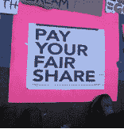

<!--yml
category: 未分类
date: 2024-05-12 20:41:58
-->

# Falkenblog: Haidt on the Moral Foundations of Occupy Wall Street

> 来源：[http://falkenblog.blogspot.com/2011/10/haidt-on-moral-foundations-of-occupy.html#0001-01-01](http://falkenblog.blogspot.com/2011/10/haidt-on-moral-foundations-of-occupy.html#0001-01-01)

Happiness author

[Jonathan Haidt](http://falkenblog.blogspot.com/2008/07/flattering-self-portraits.html)

on the Occupy Wall Street/Tea Party

[difference](http://reason.com/archives/2011/10/20/the-moral-foundations-of-occup)

:

> We really hate cheaters, slackers, and exploiters. By far the most common message I saw at OWS was that the rich (“the 1 percent”) got rich by taking without giving. They cheated and exploited their way to the top. As if that wasn’t bad enough, we the taxpayers then had to bail them out after they crashed the economy, and so now they really owe us for saving their necks. It’s high time that they started giving back, paying what they owe.
> 
> As a point of comparison, a similar look at signs found at the Tea Party rallies suggests that protesters there are also chiefly concerned with fairness. The key to understanding Tea Partiers' morality, though, is that they want to restore the law of karma. They want laziness and cheating to be punished, and they see liberalism and liberal government as an assault on that project. The liberal fairness of OWS diverges from conservative and libertarian fairness in that liberals often think that equality of outcomes is evidence of fairness.

Those who think the market is generally fair and rewards virtue, who think that unequal ability is primarily from effort, discipline, and finding one's niche, believe in markets; those who think the market is generally a rigged game that rewards vice, that people are basically equal and become unequal mainly through forces beyond their control, believe in greater government control. Equality of outcomes is justice in one case, injustice in the other. Given these different assumptions are responsible for the most pressing political disagreements we have, and these are rather factual statements, the nice thing is that someday there may be more agreement on politics.