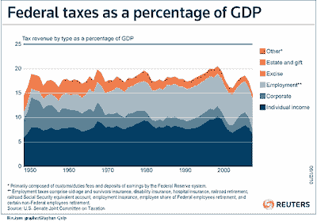
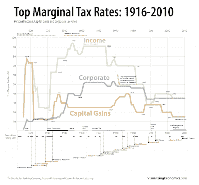
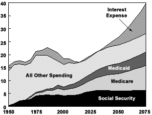

<!--yml
category: 未分类
date: 2024-05-12 20:39:44
-->

# Falkenblog: Have US Federal Revenues Hit Their Laffer Curve Limit?

> 来源：[http://falkenblog.blogspot.com/2011/11/have-us-federal-revenues-hit-their.html#0001-01-01](http://falkenblog.blogspot.com/2011/11/have-us-federal-revenues-hit-their.html#0001-01-01)

I was listening to Jeffrey Hummel's recent talk (see

[here](http://www.studiohayek.com/2011/11/liberals-at-uc-berkeley.html)

, scroll down to his picture). He argues the US federal default is inevitable, using the following reasoning.

Federal Tax revenues as a percent of GDP have consisntently been bumping up about 20% since 1951\. Even in WW2, when federal taxes were highest as a percent of GDP, tax revenues never broke 25% of GDP.

Meanwhile, top marginal tax rates, corporate rates, and capital gains tax rates have basically declined, though bouncing about quite a bit.

This suggests the 20% barrier is some kind of structural barrier in the system: people adjust their effort and tax avoidance to generate basically the same percentage of GDP over a variety of tax rates.

Here are the projected Federal expenditures from the Congressional Budget Office

Thus, the projected 30% of GDP spending in the pipeline seems impossible to finance. While conceivably we could cut our spending, its likely this will only be cut when deficits are curtailed via an explicit or implicit default.

On the brighter side, it took Rome a good 200 years to totally implode after their peak, and there's the example of Argentina, which while not as relatively prosperous as it was 100 years ago, isn't a horrible place to live.