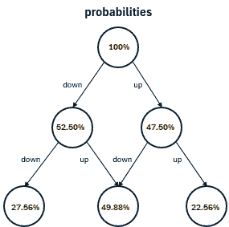

<!--yml
category: 未分类
date: 2024-05-12 19:55:31
-->

# Falkenblog: Hedging Negative Convexity

> 来源：[http://falkenblog.blogspot.com/2024/02/hedging-negative-convexity.html#0001-01-01](http://falkenblog.blogspot.com/2024/02/hedging-negative-convexity.html#0001-01-01)

 Automated market makers (AMMs) invariably present their Liquidity Providers (LPs) with convexity costs. Hedging does not eliminate or even reduce these costs but it does lower volatility. With lower cost volatility, an LP does not need as much capital to cover these losses, so considering capital is expensive, it is correct to say hedging reduces costs, though only indirectly.  

Consider the pool with a token A vs. USDC in the pool. If an LP provides 777 units of liquidity, his initial LP position would look as in Table 1 below.

**Table 1**

To model the LP's position, we can use a binomial lattice. Here, we transform a volatility assumption into an up-and-down move in the lattice. In practice, one uses many little steps, but we will show a large 10% movement for illustrative purposes. One can use the following formulas to create an arbitrage-free recombining lattice. Here, we will assume zero drift, or an expected token A return of zero. 

**Table 2**

Applying these parameters to a lattice, we start at a price of 100 and then move up or down. Given an up move is the reciprocal of a down move, up*down=1, the center node just takes one back to the starting price. Note the probabilities are not 50% as the price movements are modeled as lognormally distributed (e.g., exp(x)), so the probabilities adjust these asymmetric future prices to be consistent with the starting prices (E(p) = 100). 

**Recombining Lattice**

This approach is convenient because modeling the price of a derivative just involves applying the derivative formula to the various nodes with their distinct prices and then multiplying the derivative values in these nodes times their probability. In each period, here portrayed as a row, the probabilities add up to 1.0\. Below is a lattice applied to a v2 LP position initially hedged. The token A position in the pool is initially 77.7, so the initial hedge is short 77.7 units of token A. 

**Static Hedge**

In the final period, T=2, we see that the two tail events, each with a 1/4 probability, generate an LP loss, while the middle case, where the price is flat, has a probability of around 1/2\. If the LP did not hedge, he would see a gain in the 'up' state and a loss in the 'down' state, while in the hedged case, he would lose money in both states. 

Looking at this in Table 3 below, we can see the expected pnl for the hedged and unhedged LP positions are identical (ignoring fees here, which would be unaffected by hedging). These are the payoffs and probabilities at the bottom of the lattice. However, the unhedged LP position varies by +/- 1500, while the hedged pnl varies by +/- $75. 

**Table 3**

A dynamic hedge would be more frequent and reduce the LP's risk. The initial hedge is identical to the static hedge, so the LP's pnl is the same in period T=1 for both hedging strategies. However, in period T=1, the LP will adjust his hedge to match his new token A position, decreasing it in the up state from -77.7 to -73.91 and increasing it to -81.68 in the down state. As the hedge is readjusted, to simplify accounting, we will realize the total pnl in period T=1\. The LP pnl is not actually realized, but putting the period 1 LP pnl onto the balance sheet makes it easy to see the effect of the hedge in the subsequent period. 

The initial hedged LP position is identical to the above static hedge case, as they had identical positions in T=0

**Dynamic Hedge Path Dependent**

In period T=1, the hedge ratio is updated, and we realize hedge and LP pnl profits (expected loss is 19.40). The expected loss in the second period is 19.38, given that the initial loss was realized in period T=1, which is just the sum of the probabilities of these four states times their net pnls. The total expected loss over both periods is 38.79, identical to the static hedge. 

More frequent hedging reduces pnl volatility in the same way that a static hedge reduces the pnl volatility: they do not change the total expected LP loss, totaling 38.79 whether unhedged, statically hedged, or constantly hedged. You multiply the pnls by their respective probabilities to get the expected value. 

If you don't hedge a negatively convex position, you will lose $*x* with probability *p* after T periods, while if you hedge continuously, you will lose *x***p*/T each period. In the example above, the static hedge reduces the pnl variability from about +/- $1500 in the extreme states to +/- $75 with a static hedge, and the dynamic hedge reduces its variance further to a constant $20 each period. 

What about restricted ranges, as in Uniswap v3? Again, this doesn't change the convexity costs for a given amount of liquidity. Consider if the range had a range spanning the price movement in this example, a +/- 10% price movement. The total LP cost would be reduced by 90%, a substantial savings. One's hedge size is also reduced, reducing capital requirements further. 

Given the same liquidity, the expected convexity cost is identical for an LP, whether the range is restricted. In the lattice below, the restricted range starts with token A amount of only 7.39 vs. 77.7 in the unrestricted case, so the hedge is only -7.39 vs. -77.7\. However, in the final state, the net LP pnls are identical. 

**v3 restricted range**

Convexity costs are purely a function of gamma times the variance, and LP gamma is a linear function of liquidity. It's prudent to hedge this, but also important to realize the limits to what hedging can do. It cannot eliminate a convexity cost.