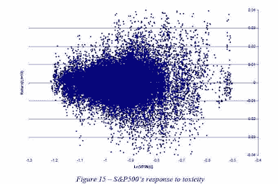

<!--yml
category: 未分类
date: 2024-05-12 20:54:00
-->

# Falkenblog: High Frequency Trading Paper

> 来源：[http://falkenblog.blogspot.com/2011/05/high-frequency-trading-paper.html#0001-01-01](http://falkenblog.blogspot.com/2011/05/high-frequency-trading-paper.html#0001-01-01)

I'm involved in high frequency trading so I don't comment much on it anymore; it's good when

not

telling people all your ideas on some subject is the optimal strategy. But there's been a rather popular piece on a new metric of volatility by Easley, de Prado, and O'Hara,

[Flow Toxicity and Volatility in a High Frequency World](http://papers.ssrn.com/sol3/papers.cfm?abstract_id=1695596)

, so it's not insider information. O'Hara has been writing on this topic for decades it seems, and she's a pretty solid author in this field. Indeed, as de Prado is associated with the Tudor Hedge fund, and they are OK with him publishing this, that highlights this information is not valuable in and of itself. But, lots of useful tools are not obviously translatable into money, so this is not a big knock.

Their Volume-Synchronized Probability of Informed Trading, or the VPIN informed trading metric, is as follows:

It's hard to see in the gif, but the numeration has Vb is the volume of buys, which are assumed to when the price of a trade is greater than or equal to the last trade price, Vs, or Volume of Sells, otherwise. Thus, the greater the imbalance of buys vs sells in the past, say, 10000 shares traded, the greater this metric. These all occur within the past V shares traded in any bucket. n is the number of number of buckets in the sample. Thus, the estimation is in transaction space, not time space, which the authors assert is more stable and meaningful.

The graph below shows how this metric forecasts future trade volatility. Note that as the log of the VPIN goes up, the dispersion of price moves increases. It's not a perfect relationship, but nothing important is.

The point is that in fast moving markets, one needs something a little better than simple historical moving averages of daily closing prices. This is better, and extending the idea of 'volume time' vs. 'chronological time' is an intriguing direction. But one can also look at bid-ask spreads directly, or the VIX futures, or its etf, the VXX, and combinations, to gauge intraday volatility as well. Further, one can better estimate 'buy volume' using the transaction price relative to the then extant bid-ask spread, rather than if the price was weakly increasing, though this then involves syncing the trade information with quote information, and for academics such data are often hard to come by (further, quote information is often 10 times as large).