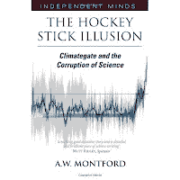

<!--yml
category: 未分类
date: 2024-05-12 21:29:00
-->

# Falkenblog: Hockey Stick Science

> 来源：[http://falkenblog.blogspot.com/2010/06/hockey-stick-science.html#0001-01-01](http://falkenblog.blogspot.com/2010/06/hockey-stick-science.html#0001-01-01)

A.W. Mortford has a book out titled

[The Hockey Stick Illusion](http://www.amazon.com/Hockey-Stick-Illusion-Climategate-Independent/dp/1906768358)

. It highlights how modern science is done (I read its 400+ pages in two days because it was fascinating). The main issues are not abstruse statistics, but rather detailed, parochial empirical issues.

Recent warming only seems alarming if recent temperatures are outside of normal historical fluctuations. As the medieval warming period when Vikings settled Greenland was obviously very warm, at least in Greenland, one might think that current temps are not that alarming. Thus, in 1998, when Michael E. Mann, Bradley and Hughes published a paper documenting that current temperatures are many standard deviations of their average since at least 1000 AD, it became the signature graph for the Global Warming Community.

Tree rings, or isotopic composition of ice cores (the ratio of

^(18)

O to

^(16)

O) and other things are related to temperature, and these are the types of things used to estimate temperature prior to 1880\. As the 20th century temperature increase that has everyone worried is only 0.6 degree centigrade, one needs some serious precision to claim that temperatures in the past 1000 years did not vary above this level. There's no fundamental law that related tree rings or oxygen isotopes to temperature, these things just have an imprecise theory and some empirical support, but it's not calibrated like some calorimeter. To think you can know the temperature in 1100 with the kind of accuracy that Mann et al present is really absurd.

The problem is there are many temperature proxies, various tree rings, ice cores, all with different results (over 400 of them). Mann et al eventually used 112 (or 159) of them for their paper, which allows for a lot of cherry picking. Further, some series are truncated, some extrapolated, using seemingly innocuous phrases like "if records terminate slightly before the 1980 training interval, they are extended by persistence". That's one bizarre way to treat missing data. They also extrapolated certain time series that did not start or end at convenient times, all with a bias towards their end ('We have to get rid of the Medieval Warm Period' said one infamous email).

There's lots of fun data issues and rhetorical strategy presented in this book that highlights how real science is done. You have two sides with pretty strong end-views--global warming is unprecedented, or not--and while both claim to simply be interested in the objective truth, after 10+ years invested in one conclusion it defies credulity to think a researcher can address this question objectively any more. Basically, we have two sets of partisan scientists presenting their case, like paid lawyers.

As David Goodstein notes in his recent book

[On Fact and Fraud: Cautionary Tales from the Front Lines of Science](http://www.scientificamerican.com/article.cfm?id=when-scientists-sin&sc=DD_20100623)

, a great quote from the great Richard Feynman:

> The first principle is that you must not fool yourself—and you are the easiest person to fool.... After you’ve not fooled yourself, it’s easy not to fool other scientists. You just have to be honest in a conventional way after that.”

The winner of this debate will be those who fooled themselves the least. Like a financial economist rigging his backtest, this may generate a publication but in the long run the data are what they are, and its best to have the facts on your side because eventually the facts win. Very few are committing conscious fraud, but rather, fraud of the more common sort, that of where a seemingly innocuous inaccuracy saves tons of explanation in their mind.

As Oscar Wilde noted, education is an admirable thing, but it is well to remember from time to time that nothing that is worth knowing can be taught. Big debates are usually not centered on not singular facts or theories, but their many observations, knowing which are relevant, which are not. Knowing how to weight correctly is mainly an exercise in meticulous research and wisdom, and it especially helps to have correct or at least popular

a priori

prejudices.