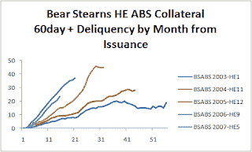

<!--yml
category: 未分类
date: 2024-05-12 23:03:22
-->

# Falkenblog: Home Equity Tranches

> 来源：[http://falkenblog.blogspot.com/2008/08/home-equity-tranches.html#0001-01-01](http://falkenblog.blogspot.com/2008/08/home-equity-tranches.html#0001-01-01)

Ahh, haven't been blogging as much because I'm doing lots of things I can't discuss, because who knows who will sue you, but I hope to discuss it in about 3 months.

In the meantime, I was pulling some data on the performance of collateral for reference obligations for home equity credit default swaps. The

[AXB home equity index](http://www.markit.com/information/products/category/indices/abx.html)

covers the prices of default swaps, for various levels of credit quality, by cohort, of pool of home equity loans. One thing that is different about consumer lending, as opposed to others, is that cohort, or the time the pool was originated, and vintage--time since origination--is very important.

For example, in 1995, credit card companies all fell over themselves to lend to anyone because the margins were so large. For a FICO score of, say, 500, these guys didn't default at such a bad rate compared to how much they were paying (people with really low credit scores aren't smart enough to know you should pay off your 21% credit card balance before getting a new truck). But the error was, this set of low credit people had other things going for them, and that's how they qualified for their loans. Thus, if you had a 500 FICO and got a consumer loan, there was probably other information relevant to you getting the loan, that mitigated your risk. A univariate analysis that made a 500 FICO look good was therefore biased, so when the companies all targeted them directly, there was a big increase in losses for that cohort (interestingly, during that debacle, the cash flow was still positive--credit cards make tons of money for their issuers).

Similarly, consumer credit has a distinctive loss curve, as in the first few months, there is little default because most people can pay that, but then they get sloppy or experience a set back, and they default. So losses start out low, increase in the first 36-48 months, then flatten out as all the riff-raff has been washed out. Thus, the vintage, or time since origination, is important.

I took several cohorts from the Bear Stearns Asset Trust (eg, 2007, 2006), and looked at their loss curves, putting them all in the same 'time from origination' frame. As you can see the latter cohorts had much greater delinquency rates. For the 2003 cohort, only 6.6% had gone 60 days delinquent after 15 months, the next year's cohort, it was 9.2, then 15.0, 27.8, and in 2007 it came down a little, to 23, which is still really high. You would have thought that after the market kind of blew up in March 2007 they would have tightened up standards immediately, but I guess no one did anything for another 6 months, at which time, the market was about to cease to exist. The 2005 and earlier cohorts are flattening out, as most of these losses have been realize, but the 2006 and2007 have to hit their inflection point. At some point, they will decline, but the question is, when.

We hope the 2006 cohort should subside in about 10 months, but it could be earlier rather than later. I would guess earlier, because generally the worst credit defaults faster than the good credit, because good credit has more a base mortality based on bad luck which is somewhat constant over time, whereas the 'bad' credit merely gets exposed quickly and then cannot default again. So, to the extent these were bad originations, the loss curves should flatten out more quickly than the base assumption. Of course, who knows. We do not have any experience with residential loss curves in this kind of environment. It's hard to defend a scenario when you don't have any comparable data, and so, this market is now closed. the ABX does not have a 2008-1 index, because nothing was issued.

It is interesting that the 2006 and 2007 cohorts were so incredibly bad. Data will come out on these, and stories about the change in underwriting standards in this period (no income verification, no money down) that were predicated on the idea that house prices do not go down, and in part due to

[official government policy](http://vdare.com/sailer/080810_loans.htm)

to increase home ownership at seemingly no cost (just a guarantee to Fannie Mae!). Lots of stupid mistakes were made, but we don't make the same ones again.