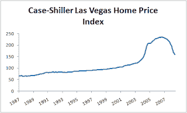

<!--yml
category: 未分类
date: 2024-05-12 23:01:16
-->

# Falkenblog: Housing Bubble in Vegas

> 来源：[http://falkenblog.blogspot.com/2008/08/housing-bubble-in-vegas.html#0001-01-01](http://falkenblog.blogspot.com/2008/08/housing-bubble-in-vegas.html#0001-01-01)

These things are so obvious with hindsight. But at the very least, it looks like we are getting very close to the old long-run trendline.