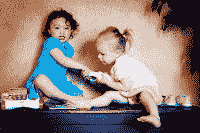

<!--yml
category: 未分类
date: 2024-05-12 20:51:58
-->

# Falkenblog: Humans Born Capitalists

> 来源：[http://falkenblog.blogspot.com/2011/06/humans-born-capitalists.html#0001-01-01](http://falkenblog.blogspot.com/2011/06/humans-born-capitalists.html#0001-01-01)

[Bastiat](http://quotes.liberty-tree.ca/quotes_by/frederic+bastiat)

noted that "Life, liberty, and property do not exist because men have made laws. On the contrary, it was the fact that life, liberty, and property existed beforehand that caused men to make laws in the first place." von Mises and Hayek

[championed this insight](http://www.cato.org/pub_display.php?pub_id=1341)

to note how private property was essential to economic efficiency via its decentralizing nature, and

[Hernando de Soto](http://reason.com/archives/2006/02/22/hernando-de-soto-interview)

applied this to problems in the third world.

While the NYTimes likes

[to put scare quotes](http://www.nytimes.com/2005/06/24/opinion/24fri1.html)

around 'property rights' when discussing eminent domain as if it's some newfangled right wing obsession, the following

[following psychology experiment](http://www.sciencenews.org/view/generic/id/74983/title/Kids_own_up_to_ownership)

suggests it's human nature:

> Rather than being learned from parents, a concept of property rights may automatically grow out of 2- to 3-year-olds’ ideas about bodily rights, such as assuming that another person can’t touch or control one’s body for no reason, Friedman proposed.
> ...
> Friedman’s team presented a simple quandary to 40 preschoolers, ages 4 and 5, and to 44 adults. Participants saw an image of a cartoon boy holding a crayon who appeared above the word “user” and a cartoon girl who appeared above the word “owner.” After hearing from an experimenter that the girl wanted her crayon back, volunteers were asked to rule on which cartoon child should get the prized object.
> 
> About 75 percent of 4- and 5-year-olds decided in favor of the owner, versus about 20 percent of adults.