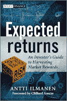

<!--yml
category: 未分类
date: 2024-05-12 21:03:40
-->

# Falkenblog: Ilmanen's Expected Returns

> 来源：[http://falkenblog.blogspot.com/2011/04/ilmanens-expected-returns.html#0001-01-01](http://falkenblog.blogspot.com/2011/04/ilmanens-expected-returns.html#0001-01-01)

If you are in the investment industry, you should read this book. You should know the facts across different asset classes.  These are essential facts.

 I just got Antti Ilmanen's

[Expected Returns](http://www.amazon.com/Expected-Returns-Investors-Harvesting-Rewards/dp/1119990726/ref=sr_1_1?s=books&ie=UTF8&qid=1302467730&sr=1-1)

, and think it's a great reference for any investment professional. Like my book, it's published by Wiley, which mean you can always buy it for half the list price on Amazon vs. going directly to Wiley (how this makes sense I have no idea). He describes the theory and data behind all the major investment strategies (eg, value, carry trade, selling volatility) and asset classes (eg, stocks, bonds, FX, real estate). At 594 pages, and given the failure of risk models and the parochial nature of various behavioral explanations, it is not a focused book, more like a compendium of what the 'state of the art' thinking is on the theory and data, as opposed to a strong theme. Indeed, there are many bullet points for the summary chapters and for the subsections, and each seem pretty independent. Yet, if you want to invest in the carry trade, or value stocks, it's a great place to go to understand the conventional wisdom on these investments.

I've been a fan of Ilmanen since he wrote several clear and concise white papers on yield curve investing back in the 1990s (

[here's](http://www.efalken.com/pdfs/yieldcurve.zip)

a zipped set). At one point he states 'My preferred approach to stuydying return consistency across subperiods is to plot cumulative returns over time. Careful eyeballing of such praphs reveals performance for any subperiod of interest, especially if he graphs are in log scale.' This kind of straightforward approach I find refreshing, because given the failure of any risk metric to generalize within or across asset classes, I find the abstruse models that claim some fundamental relation to a utility function, then proven econometrically but unamenable to a simple graph, highlights the rigor of modern finance is primarily a convenient way to hide for dopey ideas the way post-modernists hide their stupidity behind incomprehensibility.

As Cliff Asness note in the forward to this book, 'the first moment laughs at and taunts the second moment', meaning basically that means are much less certain than variances and covariances, and ultimately we want to know what the 'average return' has been for various assets and strategies. This is not obvious, because you can have periods like 1960 to 1982, where bond returns were strictly decreasing in duration as rates rose, and then the opposite from 1982-2008 when rates went the other way. But Ilmanen highlights the cases such as these where combining historical data with forward looking metrics like yields to highlight what a good expectation in these cases might be.

Now, I've corresponded a bit with Antti over the years, he's about my age, graduating about the same time. I respect him a lot. Thus, when I think about conventional wisdom in academic finance I think it's good to think about Antti, someone I think is thoughtful, smart, sincere, but also wrong about some very important points, most prominently, that this is consistent with some as-yet-undiscovered risk model.

He's a little too charitable towards various esteemed citations, as he presents the various explanations for asset/strategy returns, often inconsistent. For example, in the chapter on the premium to selling puts, he references Taleb's Black Swan, which basically argues that gamma is underpriced because people prefer negative skew (ie, people lose money selling volatility because they love the positive modal return). He references DeBondt and Thaler's 'mean reversion' findings, though they have not stood up well: they were driven by untradeable stocks, which is why they were not replicated--the ultimate rejection. Ilmanen speaks well of Peter Bernstein, who wrote incredibly popular and interesting books that have been exposed as being totally wrong (ie, the Modern Portfolio Theory lionized in

Capital Ideas

or

Against the Gods

is now admitted to be empirically vacuous--I think that matters). I guess as Malcom Gladwell, Steve Levitt, or Michael Lewis have shown, a good yarn just needs the facts to be plausible at that time, whether or not they were subsequently shown totally wrong seems irrelevant. He also states that Robert Shiller called the housing bubble, which is true only if you count the statement that the previous rise from 2000-2005 would

probably

not extend, and

some

cities

may

experience declines, as the same thing as predicting a wholesale decline in housing prices. A paper is not true or profound merely because it is popular. Indeed, many papers are more popular the more flawed they are because they present an easy straw man to best (as a default modeler, one always references

[Altman (1967)](http://en.wikipedia.org/wiki/Altman_Z-score)

, because it is popular and a really inferior model).

In some asset classes, like Hedge Funds, he notes that average top-line returns of 14% are turned to 7% when a couple of obvious adjustments are made for survivorship biases, and admits even then that since data are supplied voluntarily, this is incomplete. Yet such issues also occur in something as simple as equities, where he totally ignores transaction costs, taxes, adverse timing (market inflows). He notes investing in 'art' has had a pretty large positive real return, somewhere betveen 1 and 5%. As Felix Salmon has

[noted](http://blogs.reuters.com/felix-salmon/2009/10/06/returns-on-art/)

, these art indices exclude most art because if it is bought and never sold--usually

because

it cannot be sold--it simply disappears from the index, severely biasing such indices. Further, transaction costs selling art are considerable and not included in art indices. This highlights that estimating the first moment (mean returns) is quite subtle not merely because limited number of business cycles, but the data we have are often biased and so do not reflect a 'return to an average investor' (eg, buying a mutual fund in the 1960's had an 8.5% load right off the top). These are not small adjustments, and highlights the important adjustments are not sophisticated statistics, but rather yeoman's work.

As to the 'expected returns' distinction, this I find really gets into scholasticism. Theoretically, there's only a relation between expected risk and expected returns, what actually happens involves random chance. As expected returns change over time, and one only observes average returns, one can argue that expected returns are quite different than what was experienced, or not. He notes that 'periods of high realized returns and rsing asset valuations--think stock markets in the 1990s--are often associated with falling forward-looking returns.' ORLY? If people in 2000

expected

to experience the next decade of negative returns and also massive volatility, stockholders were making the stupidest financial decision since

[Esau](http://lavistachurchofchrist.org/Pictures/Standard%20Bible%20Story%20Readers,%20Book%20Six/target5.html)

traded his inheritance for a bowl of soup.

[Sharpe and Amromin](http://papers.ssrn.com/sol3/papers.cfm?abstract_id=1327134)

(2009) surveyed investors and found they basically were inversely related to subsequent returns, reaching a peak at the top of the internet bubble at the end of the 1990s. So were expected returns higher then, as suggested by what investors said, or lower, as suggested by the returns the realized (and ex-post measures of valuations implied)? This conflation of average and expected returns is used selectively by academics all the time, where 'sample average' is synonymous with 'expected' sometimes, and sometimes not, depending on the author's objective. It makes one wonder if the 10^500 universes of string theory is more falsifiable than asset pricing theory.

The main strategic take-aways I would pull would be the following:

1) Simple valuation metrics like P/Es in stocks, the current roll in futures, or yield spreads between currencies, help predict returns. They are easy to measure so try to have them on your side. It does not seem like any 'risk' premium, but rather a free lunch (or, the same thing, a risk premium so convoluted no one understands it and it does not generalize).

2) Momentum, chasing past returns, is not a bad strategy. That is, invest more in asset classes and strategies that have been working over the past year. Again, it seems like a risk-free, easy way, to improve returns.

Bottom line is that if you are presenting a case for some major asset allocation, you should be familiar with the data and arguments noted in this book.