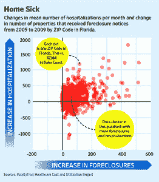

<!--yml
category: 未分类
date: 2024-05-12 20:46:42
-->

# Falkenblog: In practice, Correlation Implies Causation

> 来源：[http://falkenblog.blogspot.com/2011/09/in-practice-correlation-implies.html#0001-01-01](http://falkenblog.blogspot.com/2011/09/in-practice-correlation-implies.html#0001-01-01)

Of course, everyone knows the cliche that correlation does not imply causation, but in practice any correlation that fits into a narrative is seen as evidence of that theory. This NBER

[paper](http://www.nber.org/papers/w17310)

by Currie and Tekin argues foreclosures lead to a variety of bad health outcomes--sort of like the symptoms of chronic fatigue syndrome. It's a joke, but sure got a lot of play over the past few days because it's so darn helpful to some people. See the attached graph, which underlies their findings. The NBER, like the American Economic Association, is a pretty official, bureaucratic, PC trade institution that wants to be relevant and respected.

This is the same group

[condemned](http://ideas.repec.org/a/aea/jeclit/v33y1995i2p762-776.html)

The Bell Curve for producing arguments directly to a public that could not understand statistics as well as trained economists, an absurd proclamation that would eliminate all working papers and books. Econometric technique is much less important than one's biases, which is why we should have 'free-market', 'Marxist', and 'Keynesian' econometricians, just like we have Republican and Democratic pollsters. It's not like a lifetime Keynesian/supply-sider, at age 50, will suddenly publish a paper documenting that fiscal multipliers are exactly opposite to their preconceptions. It's the meta-decisions of what to look at, what to control for, that fall outside any formal statistics that determine most interesting conclusions, not some asymptotic distribution on moment restrictions.