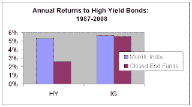

<!--yml
category: 未分类
date: 2024-05-12 23:05:05
-->

# Falkenblog: Index Returns Biased

> 来源：[http://falkenblog.blogspot.com/2008/08/index-returns-biased.html#0001-01-01](http://falkenblog.blogspot.com/2008/08/index-returns-biased.html#0001-01-01)

I was looking at the Merrill Lynch High Yield Master, an index of junk bonds, and found that the return for the past 10 years was about the same as for Merrill's Investment Grade index. But what are the actual returns, because you can't necessarily buy and sell at 'closing' prices? I pulled all the closed end funds with investment grade (about 10), and junk portfolios (27), that existed from 1997-2008\. There, a different story emerged. While the Investment Grade funds closely mimicked the Investment Grade indices, the High Yield funds did not. And this is with survivorship bias, as I took only extant funds and so excluded the biggest losers that might have died over that period, but were alive in 1997\.

Transaction costs are relevant to assessing the returns to illiquid securities, and so any index of an illiquid asset class needs to be adjusted accordingly.