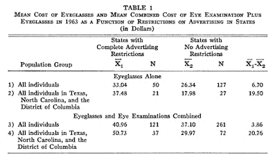

<!--yml
category: 未分类
date: 2024-05-12 21:51:26
-->

# Falkenblog: Is Marketing Expense Wasteful?

> 来源：[http://falkenblog.blogspot.com/2009/08/is-marketing-expense-wasteful.html#0001-01-01](http://falkenblog.blogspot.com/2009/08/is-marketing-expense-wasteful.html#0001-01-01)

In the health care debate, many have noted the high level of administration expense, as there's the idea that without marketing expense, public healthcare will be cheaper.

Marketing has always seemed wasteful to those who are optimistic about government solutions, and indeed a big theme of

[John Kenneth Galbraith](http://en.wikipedia.org/wiki/John_Kenneth_Galbraith)

's oeuvre was that businesses waste money advertising. It seem that many think advertizements merely reallocate our expenditures in a zero-sum game of moving from Coke to Pepsi, Bud to Coors, without any real effects.

In 1972 Lee Benham presented what I think is one of the greatest empirical economic articles of all time (

[The Effect of Advertising on the Price of Eyeglasses](http://bpp.wharton.upenn.edu/waldfogj/987/readings/benham.pdf)

). Optometrists give eye exams, and provide prescription glasses. Some states regulated optometry such that they could not advertise, others did not. The result? Those states with advertising had lower prices. This table basically says it all.

It seems that without advertising, firms don't compete as much, leading to higher prices.