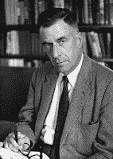

<!--yml
category: 未分类
date: 2024-05-12 21:19:53
-->

# Falkenblog: John Kenneth Galbraith

> 来源：[http://falkenblog.blogspot.com/2010/10/john-kenneth-galbraith.html#0001-01-01](http://falkenblog.blogspot.com/2010/10/john-kenneth-galbraith.html#0001-01-01)

Nice evisceration of

[John Kenneth Galbraith in the WSJ](http://online.wsj.com/article/SB10001424052748703556604575501883282762648.html)

. He was wrong on all his major arguments, namely that the market was always overvalued and about to crash (from 1954 onward this was his familiar refrain),that large companies had huge advantages over small ones via their price setting ability and 'planning', and that those who argued against him were spouting 'conventional wisdom' (his liberalism was the conventional wisdom throughout his life). Lastly, he was fond of mentioning all the good things the Soviet Union did compared to the United States. He was always one of the world's most esteemed economist, highlighting that 'famous' doesn't mean 'profound'.

Galbraith was one of the first to criticize the capitalist economy for its prosperity, what he called private affluence, as if the new cars and computers being made were wastes of money relative to more spending on schools (really anything, as long as the government spent it). Hayek had a great comment on Galbraith in his essay

[The Non-Sequitur of the Dependence Effect](http://mises.org/etexts/HayNonseq.pdf)

:

> I believe the author would agree that his argument turns upon the "Dependence Effect". The argument starts from the assertion that a great part of the wants, which are still unsatisfied in modern society are not wants which would be experienced spontaneously by the individual if left to himself but are wants which are created by the process by which they are satisfied. It is then represented as self-evident that for this reason such wants cannot be urgent or important. This crucial conclusion appears to be a complete non sequitur and it would seem that with it the whole argument of the book collapses.
> 
> The first part of the argument is of course perfectly true: we would not desire any of the amenities of civilization-or even of the most primitive culture - if we did not live in a society in which others provide them. The innate wants are probably confined to food shelter, and sex. All the rest we learn to desire because we see others enjoying various things. To say that a desire is not important because it is not innate is to say that the whole cultural achievement of man is not important.