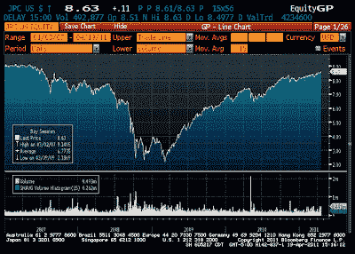

<!--yml
category: 未分类
date: 2024-05-12 21:02:27
-->

# Falkenblog: Junk Bond Returns 43% or 20% Since 2007

> 来源：[http://falkenblog.blogspot.com/2011/04/junk-bond-returns-43-or-20-since-2007.html#0001-01-01](http://falkenblog.blogspot.com/2011/04/junk-bond-returns-43-or-20-since-2007.html#0001-01-01)

Above is a total return graph for

[JPC](http://www.nuveen.com/CEF/Product/Holdings.aspx?fundcode=JPC)

, Nuveen's High yield convert ETF, from 2007 (ie, 1/1/2007) to present. Note the return is basically zero. I pulled 39 High Yield ETFs, and their average return from 2007 to present has been about 21%, and is the same whether I equal-weight or value weight them, and note these have a survivorship bias in them, in that I am not using all extant funds from 2007\. The JPC benchmark, the Bloomberg Active Index for Corporate Preferred funds generates a similar 20% return over that period.

In contrast, the Merrill High Yield Master II shows a whopping 43% return over this period, twice what bonds with that moniker actually generated. The Merrill index is not tradeable, which is very important. The bid-ask spreads in junk bonds are very high, often 5 points, and indices don't internalize these. Also, if you are big, there's trade impact. Academics might look at the Merrill index to estimate the return to junk bonds, but there's a 22% difference here, and that excludes all the survivorship biases in my comparison to actual funds.