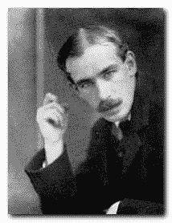

<!--yml
category: 未分类
date: 2024-05-12 22:45:05
-->

# Falkenblog: Keynesian Spending Coming

> 来源：[http://falkenblog.blogspot.com/2008/12/keynesian-spending-coming.html#0001-01-01](http://falkenblog.blogspot.com/2008/12/keynesian-spending-coming.html#0001-01-01)

On CNBC NPWE (

N

obel

P

rize

W

inning

E

conomist) Paul Krugman was giddy about the probability and size of future Federal Spending that Obama has hinted is in the pipeline. The

[government multiplier](http://en.wikipedia.org/wiki/Multiplier_(economics))

, if it worked, sure has not shown itself to increase GDP per capital or alleviate business cycles (Japan had a massive new fiscal stimulus package every two or three years from 1990 to 2005, and it did not work). But in any case, the logic of the government multiplier is rather straightforward partial equilibrium economics. It basically says, since people spend 60% of what they make, when the government spends $1, it actually creates $2.5 via the iteration of following that dollar through the economy (1+0.6+0.6^2+0.6^3+...). Thus, government spending basically pays for itself, because if you tax $2.5 by 40%, you get your initial dollar back!

This only works when we are below 'potential' GDP, which is the GDP if everyone were fully employed at the job of their choosing, which means never in real time (though economists look back wistfully at the 1960's and 1940's). An economic solution without a trade-off is surely too good to be true, and it was, as economies in the West all broke the bank in the 1960's and 1970's, and it just resulted in high amounts of debt, inflation, and lower productivity growth.

The idea that government spending has these multiplicative benefits irrespective of the cost-benefit of the actual government program is ridiculous. Plus, the only way to generate instant spending is not building bridges or roads because of the planning, logistics, and environmental impact issues, so if you have to actually write checks next year, you have to spend it on total patronage featherbeading: white collar bureaucrats who

help

implement jobs

administering

social work programs. It would be more honest and less annoying to pay them to join a UAW

[Jobs Bank](http://maggiesnotebook.blogspot.com/2008/11/uaw-jobs-bank-breaks-bank-organized.html)

(at least those people leave us alone).

Keynes was a good writer and no fool, but that does not mean his biggest ideas are any good. It is rare and admirable to be clever, but rarer still to be that

and

correct on things that are important. The net net of his General Theory is blather, as if the economy were a hydrodynamic pump; incentives, expectations, government borrowing, and the nature of government spending, did not matter. Tyler Cowen is

[blogging on the General Theory](http://www.marginalrevolution.com/marginalrevolution/2008/11/new-mr-book-clu.html)

, but while a seminal work, its also wrong. There are lots of formerly popular theories from the past that don't work, so reading them for historical reasons is pretty unhelpful (like other signature books that were wrong: Coming of Age in Samoa, Silent Spring, Sexual Behavior in the Human Male, The Ego and the Id).

Keynes' Big Point was the dismissal of Say’s law, that supply creates its own demand, as opposed to the new theory, which is that government spending, properly managed, can keep an economy at “full employment.” So what has demand management wrought? Inflationary spirals and their inevitable cataclysms, a rationale for greater government spending, and a general waste of time looking at business cycles at the expense of growth theory. To Keynes, entrepreneurship and wealth creation were descriptions of any investment process whether managed by a politburo, a despot, or an energetic profit maximizer. Nancy Pelosi, Bill Gates--what's the difference? Clever, yes. Wise, no.

Schopenhauer said all truth passes through three stages. First it is ridiculed. Next it is violently opposed. Last it is recognized as self-evident. Conversely with proposed profundities that rationalize the current intellectual zeitgeist: first hailed as revolutionary, next found to have no empirical assertions that are true, and last recognized as merely 'inspirational'.

Many economists think that in spite of the contradictions, and some rather unfortunate wording about 'euthanizing the rentier' (this when Kulaks in Russia were being really euthanized), it was great because it created macroeconomics as we know it, and so could 'handle' the Great Depression. I think prior depressions, and regular recessions, were handled much better pre-1936 than post.

As stated by von Mises (see

[here](http://laissez-fairerepublic.com/SaysLawofMarkets.html)

):

> His contribution consisted rather in providing an apparent justification for the policies which were popular with those in power…His achievement was a rationalization of the policies already practiced.

The Economist's economist, Paul Samuelson, said it best, describing Keynes' The General Theory as follows:

> It is a badly written book, poorly organized… it is arrogant, bad-tempered, polemical… it abounds in mare's nests and confusions: involuntary unemployment, wage units, the equality of savings and investments, the timing of the multiplier, interactions of marginal efficiency upon the rate of interest and many others… flashes of insight and intuition intersperse tedious algebra. An awkward definition suddenly gives way to unforgettable cadenza. When it is finally mastered, we find its analysis to be obvious and at the same time new. In short, it is a work of genius.

With that kind of reasoning, we are all merely several beers away from genius. For some reason, really smart mathematicians are highly susceptible to those who seem intelligent but show no doubt, as if they reverse reason that the only way someone as smart as X could believe Y with such certainty, is that Y is true! Much of what we are taught as the high intellectual history of the social sciences is based more on the magnetism and impenetrable self-assurance of thinkers than on minor issues like whether they were right or not.