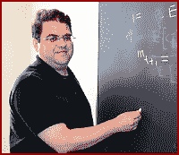

<!--yml
category: 未分类
date: 2024-05-12 21:47:37
-->

# Falkenblog: Kocherlakota Praises Macro, Leaves

> 来源：[http://falkenblog.blogspot.com/2009/10/kocherlakota-praises-macro-leaves.html#0001-01-01](http://falkenblog.blogspot.com/2009/10/kocherlakota-praises-macro-leaves.html#0001-01-01)

Not two weeks after penning a stirring defense of macroeconomics, archetypal macroeconomist Narayana Kocherlakota packs it up to be

[an administrator](http://online.wsj.com/article/SB125434451183553661.html)

(I blogged on his post

[here](http://falkenblog.blogspot.com/2009/09/macroeconomist-says-macroeconomics.html)

, but Kocherlakota has strangely removed his remarks from his homepage). Actually, he is

President

of the Minneapolis Fed, but given their narrow mandate this job does not require much strategic savvy. Your daily planner merely has your 4-dimensional coordinates for a speech, which must include 3% new material, and the instruction "don't say anything stupid!" Unfortunately, the Nash equilibrium to this game is to say nothing interesting.

Revealed preference is very, well, revealing. If you are studying physics in the early twentieth century they can't pay you to leave. If you are in the equivalent of the Peace Studies department, and you can get a cushy job making banal statements about current events on the rubber chicken circuit, the choice is obvious.