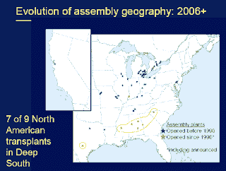

<!--yml
category: 未分类
date: 2024-05-12 22:44:17
-->

# Falkenblog: Krugman's Nobel Lecture

> 来源：[http://falkenblog.blogspot.com/2008/12/krugmans-nobel-lecture.html#0001-01-01](http://falkenblog.blogspot.com/2008/12/krugmans-nobel-lecture.html#0001-01-01)

If you have an hour to present to the Nobel committee, you lay out your Big Idea. Krugman's presentation

[here](http://www.princeton.edu/~pkrugman/nobelslides.pdf)

is pretty good. He goes over the puzzle, his solution, and why it is interesting.

Basically, international trade is predicated on comparative advantage, so that regardless of total productivity, if the relative productivity of nations in particular goods is different, there are gains from trade. That is, if I can make a $10 worth of wine in 1 hour, and $20 worth of cloth in 1 hour, and you make $5 worth of wine or cloth in 1 hour, it is best that I make all the cloth, and then buy all the wine from you, and you buy cloth from me. The essence of our relative productivity, presumably, if from differences in resources. But over time trade stopped being 'North-South', that is, from developed countries in the Northern Hemisphere to non-developed countries in the Southern Hemispher (trading hi-tech goods for commodities), to more trade between developed countries. This was a puzzle to standard models, that would expect specialization in more fundamental items, like high-tech and low-tech. This is because technology should spread out over time, so Germany and France should have fewer comparative advantages relative to each other, compared to say Germany and Nigeria.

Krugman points out that if there are increasing returns to scale geographically (with an area within a country), a high tech sector in computers may get more and more productive, while an auto manufacturer may also get more productive, though both are 'high tech' in some sense. Thus, increasing returns to scale are important in explaining the growth of various economic sectors.

This is a pretty good idea. It is simple, but that is not a knock. Indeed, many great economic ideas are simple, such as comparative advantage, the Invisible Hand, search theory, Nash equilibria, or ARCH models. That they can be refined mathematically is merely a plus for insiders, but I think the power of simple ideas highlights that there is probably too much mathematics in economics, because the level at which one can debate and discuss the returns to scale argument is really not aided by set theory, (s,S) inventory modeling, or dynamic programming. The number of really good economic insights--true and important--that are only discernible after learning graduate level mathematics, statistics or economics, is a pretty small set (

[Arrow's Impossibility Theorem](http://en.wikipedia.org/wiki/Arrow%27s_impossibility_theorem)

, the

[Revelation Principle](http://en.wikipedia.org/wiki/Revelation_principle)

).

Krugman then shows that such economies of scale seem to be diminishing. He presents a graph that shows new US auto plants are outside the geographies where there were increasing returns to scale at one time in this area (eg, Detroit), suggesting that there are no longer increasing returns to scale in certain geographies. The new plants are in the south. What is happening to increasing returns to scale? In my mind, it's clearly an attempt to get away from the UAW, the auto unions, which have made productivity growth near impossible with their onerous work rules and penchant for turning any ephemeral productivity increase into parri passu wage increases. So new manufacturers make sure they are far enough away to make unions less likely. Thus at one level, this Nobel Prize winning economist is still pretty much at 40,000 feet in explaining trends happening on the ground. A good idea, but it put academic economics in perspective.